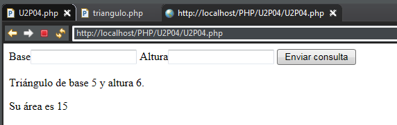
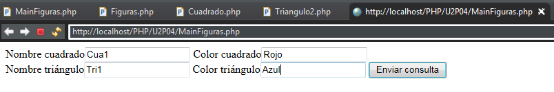
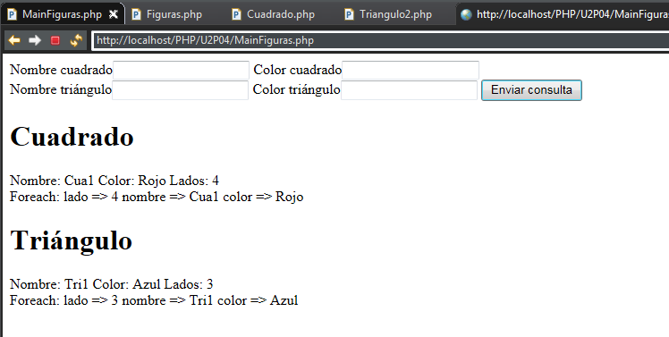

###### *Desarrollo Web en Entorno Servidor - Curso 2017/2018 - IES Leonardo Da Vinci - Alberto Ruiz*
## U2P04 - Clases y objetos
#### Entrega de: *Zhenyu Guo*
----
#### 1. Descripción:

Practica sencilla para trabajar con clases y objetos en PHP.

#### 2. Formato de entrega:

Un documento en el que se incluya el codigo fuente del archivo o archivos generados, así como una captura de pantalla de una ejecución.

#### 3. Trabajo a realizar:

Realiza una aplicación web que recoja en un formulario unos datos y los utilice para crear un objeto de una clase, llamar a uno de sus metodos, y mostrar el resultado por pantalla.

Ejemplo basado en la documentacion: 

1. Mostrar un formulario con dos campos para introducir la base y la altura de un triángulo

   ````php+HTML
   <form action="<?php echo htmlspecialchars($_SERVER["PHP_SELF"],ENT_QUOTES,"UTF-8")?>" method="post">
   Base<input type="text" name="base">
   Altura<input type="text" name="altura">
   <input type="submit" name=enviar>
   </form>
   ````

2. Instanciar un objeto de la clase Triangulo

   ````php+HTML
   <?php
   class Triangulo{
       public $base;
       private $altura;
       
       function __construct($altura,$base){
           $this->altura=$altura;
           $this->base=$base;
       }
       
        public function getAltura(){
            return $this->altura;
        }
        
        public function setAltura($altura){
            $this->altura=$altura;
        }
        
        public function calcularArea(){
            return $this->base * $this->altura / 2;
        }
        
        public function __toString(){
            return "Triángulo de base ".$this->base." y altura ".$this->altura.".";
        }
   }

   ?>
   <?php 
   include 'triangulo.php';
   ?>
   <?php 
   if (isset($_POST["enviar"])){
       $t1=new Triangulo($_POST["altura"], $_POST["base"]);
   }
   ?>
   ````

3. Invocar el método *calcularArea*

   ````php+HTML
    echo "<p>Su área es ".$t1->calcularArea()."</p>";
   ````

4. Mostrar el resultado cuidando la presentación 

   

Se pide pensar en un ejemplo diferente a este, de igual o mayor complejidad

````php+HTML
Main

<!DOCTYPE html>
<html>
<head>
<meta charset="UTF-8"/>
<title></title>
</head>
<body>
<?php 
include 'Cuadrado.php ';include 'Triangulo2.php';
?>

<form action="<?php echo htmlspecialchars($_SERVER["PHP_SELF"],ENT_QUOTES,"UTF-8")?>" method="post">
Nombre cuadrado<input type="text" name="nombre1">
Color cuadrado<input type="text" name="color1"><br>
Nombre triángulo<input type="text" name="nombre2">
Color triángulo<input type="text" name="color2">
<input type="submit" name=enviar>
</form>
<?php 
if (isset($_POST["enviar"])){
    $figura1=new Cuadrado($_POST["nombre1"], $_POST["color1"]);
    $figura2=new Triangulo2($_POST["nombre2"], $_POST["color2"]);
    echo "<h1>Cuadrado</h1>";
    echo "Nombre: ".$figura1->getNombre()." Color: ".$figura1->getColor()." Lados: ".$figura1->getLado()."<br>";
    $figura1->ver();
    echo "<h1>Triángulo</h1>";
    echo "Nombre: ".$figura2->getNombre()." Color: ".$figura2->getColor()." Lados: ".$figura2->getLado()."<br>";
    $figura2->ver();
}
?>
<br>
</body>
</html>
````

````php+HTML
Clase Figuras

<?php
class Figuras{
    private $nombre,$color;
    function __construct($nombre,$color){
        $this->nombre=$nombre;
        $this->color=$color;
    }
    function getNombre(){
        return $this->nombre;
    }
    function getColor(){
        return $this->color;
    }
    function setNombre($nombre){
        $this->nombre=$nombre;
    }
    function setColor($color){
        $this->color=$color;
    }
    function ver(){
        echo "Foreach: ";
        foreach ($this as $clave => $valor){
            print "$clave => $valor \n";
        }
    }
}
?>
````

````php+HTML
Clase Cuadrado

<?php
include 'Figuras.php';
class Cuadrado extends Figuras{
    protected $lado;
    function __construct($nombre,$color){
        parent::__construct($nombre, $color);
        $this->lado=4;
    }
    function getLado(){
        return $this->lado;
    }
    function ver(){
        parent::ver();
    }
}
?>
````

````php
Clase Triangulo 2

<?php
class Triangulo2 extends Figuras{
    protected $lado;
    
    function __construct($nombre,$color){
        parent::__construct($nombre, $color);
        $this->lado=3;
    }
    function getLado(){
        return $this->lado;
    }
    
    function ver(){
        parent::ver();
    }
}

?>
````

Ejecución:






Si te sobra tiempo y lo deseas puedes investigar e incorporar a tu actividad otros elementos de programación orientada a objetos en PHP, como:

 * [La herencia](http://php.net/manual/es/language.oop5.inheritance.php "")
 * [La impresion de todos los atributos de un objeto utilizando *foreach*](http://php.net/manual/es/language.oop5.iterations.php "")
 * [Las referencias a objetos](http://php.net/manual/es/language.oop5.references.php "")


