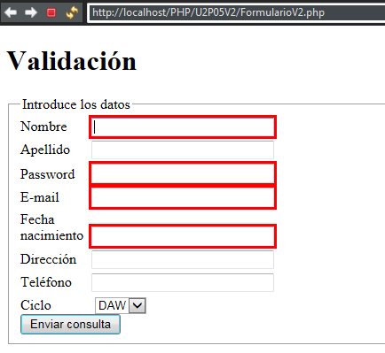
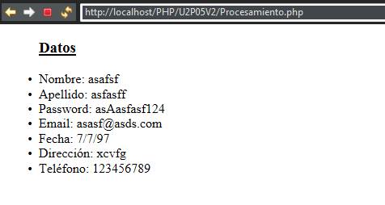
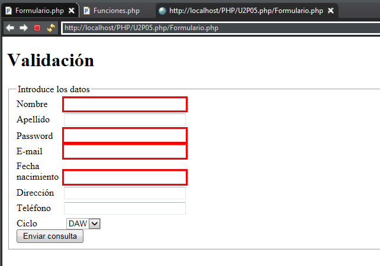
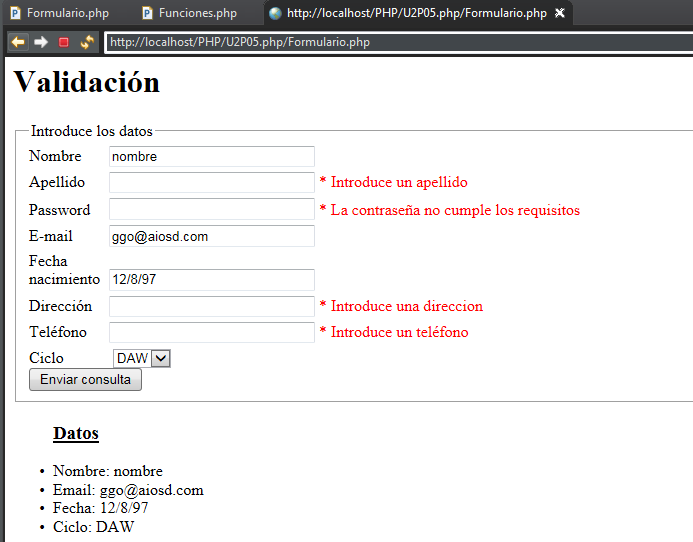
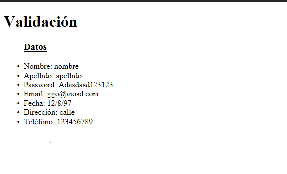

###### *Desarrollo Web en Entorno Servidor - Curso 2017/2018 - IES Leonardo Da Vinci - Alberto Ruiz*
## U2P05 - Validación de formularios
#### Entrega de: *Zhenyu Guo*
----
#### 1. Descripción:

El objetivo de la práctica es investigar en grupo las posibilidades de validación de formularios desde el servidor. Ten en cuenta que existen muchos otros métodos para validar directamente en cliente, ahorrando el envío y respuesta de información al servidor.

#### 2. Formato de entrega:

Rellena el apartado Memoria situado al final de este enunciado.

#### 3. Trabajo a realizar:

Codifica una aplicación web que recoja los datos de alta de un alumno, incluyendo nombre, apellidos, password, email, fecha de nacimiento, dirección, teléfono y ciclo formativo. Puedes incluir más datos si lo deseas. Debes incluir dos versiones de la solución: una con dos archivos (formulario y procesamiento) y otra con un solo archivo. 

Si el usuario introduce correctamente los datos, se mostrarán en pantalla. Si no los introduce correctamente, se volverá a mostrar el formulario pero:

* Si en un campo ha habido un problema, se mostrará un mensaje de error explicándolo, a ser posible junto al propio campo
* Se recordarán los datos que sí introdujimos correctamente

Indicaciones:

* Utiliza tipos de campos HTML 5 para el email, el teléfono, la contraseña y la fecha de nacimiento. ¿Pueden ayudar a hacer validación en cliente?
* Tú decides los criterios de seguridad que debe cumplir la contraseña para considerarse válida. Sugerencia: mínimo ocho caracteres, y que utilice minúsculas, mayúsculas y algún símbolo de puntuación


* Para recordar los valores, tendrás que recoger lo que escribió el usuario en un campo, e incluirlo como valor inicial de ese mismo campo al mostrar el formulario


* Para ver si un campo está relleno, podemos usar la función booleana *empty()*.
* Aunque la función *isset()* no sirve para campos de texto, sí es útil para botones de radio o de selección

##### Etapa 1: Formación de grupos
Esta práctica la realizaréis en grupos de dos.

##### Etapa 2: Ideas previas
Sin utilizar Internet, discutid posibles ideas para la validación y mejora de los formularios, sin llegar a implementarlas. Tomad nota de las ideas. Intentad plantear la lógica del programa (la estructura del procesamiento)

##### Etapa 3: Investigación
Utilizad Internet para investigar formas aceptadas de validación en PHP. Hablamos de técnicas sencillas, y en ningún caso de técnicas o lenguajes de cliente. A la hora de buscar fuentes, tened en cuenta:
1. La credibilidad de la fuente
2. La fecha de escritura de la información
3. La versión de PHP utilizada


##### Etapa 4: Codificación
Aplicad vuestras ideas para diseñar una aplicación en PHP que recoja datos, algunos de ellos obligatorios, y se comporte de la forma más amigable y útil posible para el usuario.

##### Etapa 5: Resultado
Solución en dos archivos: código del archivo php para formulario:

```php+HTML
<!DOCTYPE html>
<html>
<head>
<meta charset="UTF-8"/>
<title>Validación</title>
<style type="text/css">
label {display:inline-block;width: 80px;}
input[type="text"]{width: 200px;margin-bottom: 5px;}
input[type="email"]{width: 200px;margin-bottom: 5px;}
input[type="password"]{width: 200px;margin-bottom: 5px;}
input[type="tel"]{width: 200px;margin-bottom: 5px;}
input[type="date"]{width: 200px;margin-bottom: 5px;}
a{color:red;}
</style>
</head>
<body> 
<h1>Validación</h1>
    <fieldset>
    <legend>Introduce los datos</legend>
    <form action="Procesamiento.php" method="post">
    <label>Nombre</label><input type="text" name="nombre" value="<?php if (isset($_POST["eviar"]))echo $nombre?>" required="required"><br>
    <label>Apellido</label><input type="text" name="apellido" value="<?php if (isset($_POST["eviar"]))echo $ape?>"><br>
    <label>Password</label><input type="password" name="pass" value="<?php if (isset($_POST["eviar"]))echo $pass?>" required="required"><br>
    <label>E-mail</label><input type="email" name="email" value="<?php if (isset($_POST["eviar"]))echo $email?>" required="required"><br>
    <label>Fecha nacimiento</label><input type="date" name="fecha" value="<?php if (isset($_POST["eviar"]))echo $fecha?>" required="required"><br>
    <label>Dirección</label><input type="text" name="direccion" value="<?php if (isset($_POST["eviar"]))echo $dir?>"><br>
    <label>Teléfono</label><input type="tel" name="tel" value="<?php if (isset($_POST["eviar"]))echo $tel?>"><br>
    <label>Ciclo</label>
    <select name="ciclo">
    	<option value="DAW">DAW</option>
    	<option value="ASIR">ASIR</option>
    </select><br>
    <input type="submit" name=enviar>
    </form>
    </fieldset>
</body>
</html>
```
Solución en dos archivos: código del archivo php para procesar el formulario:

```php+HTML
<?php 
if (!isset($_POST["enviar"])){
    header("Location: FormularioV2.php");
}
?>
<!DOCTYPE html>
<html>
<head>
<meta charset="UTF-8"/>
<title>Validación</title>
</head>
<body>
<?php 
include 'Funciones.php';
$nombre=NULL;$ape=NULL;$pass=NULL;$email=NULL;$fecha=NULL;$dir=NULL;$tel=NULL;$ciclo=NULL;
$Obnom=false;$Obape=false;$Obpass=false;$Obemail=false;$Obfecha=false;$Obdir=false;$Obtel=false;
if (isset($_POST["enviar"])){
    /*Nombre*/
    if(validar_nom_ape($_POST["nombre"])){
        $Obnom=true;
        $nombre=$_POST["nombre"];
        $validado[]="Nombre: ".$_POST["nombre"];
    }
    /**/
    /*Apellido*/
    if(validar_nom_ape($_POST["apellido"])){
        $Obape=true;
        $ape=$_POST["apellido"];
        $validado[]="Apellido: ".$_POST["apellido"];
    }
    /*Password*/
    if (validar_clave($_POST["pass"])){
        $Obpass=true;
        $pass=$_POST["pass"];
        $validado[]="Password: ".$_POST["pass"];
    }
    /*Email*/
    if(validar_email($_POST["email"])){
        $Obemail=true;
        $email=$_POST["email"];
        $validado[]="Email: ".$_POST["email"];
    }
    
    /*Fecha*/
    if (validar_fecha($_POST["fecha"])){
        $Obfecha=true;
        $fecha=$_POST["fecha"];
        $validado[]="Fecha: ".$_POST["fecha"];
    }
    
    /*Dirección*/
    if (validar_dir($_POST["direccion"])){
        $Obdir=true;
        $dir=$_POST["direccion"];
        $validado[]="Dirección: ".$_POST["direccion"];
    }
    /*Teléfono*/
    if(!empty($_POST["tel"])){
        if (is_numeric($_POST["tel"])){
            if (validar_tel($_POST["tel"])){
                $Obtel=true;
                $tel=$_POST["tel"];
                $validado[]="Teléfono: ".$_POST["tel"];
            }
        }
    }
    /*Ciclo*/
    if (isset($_POST["ciclo"])){
        $ciclo=$_POST["ciclo"];
    }
    if($Obemail&& $Obfecha && $Obnom && $Obpass){
        if (isset($_POST["enviar"])){
            ?>
            <ul>
           	<ins><h3>Datos</h3></ins>
            <?php
            foreach ($validado as $valido){
                echo "<li>$valido</li>";   
            }
            ?>
            </ul>
                <?php 
                
       	}
    }
    if($Obemail&& $Obfecha && $Obnom && $Obape && $Obpass && $Obdir && $Obtel){
        $completo=true;
    }
    
}
?>
</body>
</html>
```
Captura o capturas de pantalla mostrando su funcionamiento:





Solución en un archivo:

```php+HTML
Formulario.php
<!DOCTYPE html>
<html>
<head>
<meta charset="UTF-8"/>
<title>Validación</title>
<style type="text/css">
label {display:inline-block;width: 80px;}
input[type="text"]{width: 200px;margin-bottom: 5px;}
input[type="email"]{width: 200px;margin-bottom: 5px;}
input[type="password"]{width: 200px;margin-bottom: 5px;}
input[type="tel"]{width: 200px;margin-bottom: 5px;}
input[type="date"]{width: 200px;margin-bottom: 5px;}
a{color:red;}
</style>
</head>
<body> 
<h1>Validación</h1>
<?php include 'validacion.php';
global $completo;
if (!$completo){
?>
    <fieldset>
    <legend>Introduce los datos</legend>
    <form action="<?php echo htmlspecialchars($_SERVER["PHP_SELF"],ENT_QUOTES,"UTF-8")?>" method="post">
    <label>Nombre</label><input type="text" name="nombre" value="<?php echo $nombre?>" required="required"><br>
    <label>Apellido</label><input type="text" name="apellido" value="<?php echo $ape?>"><br>
    <label>Password</label><input type="password" name="pass" value="<?php echo $pass?>" required="required"><br>
    <label>E-mail</label><input type="email" name="email" value="<?php echo $email?>" required="required"><br>
    <label>Fecha nacimiento</label><input type="date" name="fecha" value="<?php echo $fecha?>" required="required"><br>
    <label>Dirección</label><input type="text" name="direccion" value="<?php echo $dir?>"><br>
    <label>Teléfono</label><input type="tel" name="tel" value="<?php echo $tel?>"><br>
    <label>Ciclo</label>
    <select name="ciclo">
    	<option value="DAW">DAW</option>
    	<option value="ASIR">ASIR</option>
    </select><br>
    <input type="submit" name=enviar>
    </form>
    </fieldset>
    <?php 
}
    ?>
</body>
</html>
```

````php+HTML
validacion.php
<?php
include 'Funciones.php';
$nombre=NULL;$ape=NULL;$pass=NULL;$email=NULL;$fecha=NULL;$dir=NULL;$tel=NULL;$ciclo=NULL;
$Obnom=false;$Obape=false;$Obpass=false;$Obemail=false;$Obfecha=false;$Obdir=false;$Obtel=false;

if (isset($_POST["enviar"])){
    /*Nombre*/
    if(validar_nom_ape($_POST["nombre"])){
        $Obnom=true;
        $nombre=$_POST["nombre"];
        $validado[]="Nombre: ".$_POST["nombre"];
    }
    /**/
    /*Apellido*/
    if(validar_nom_ape($_POST["apellido"])){
        $Obape=true;
        $ape=$_POST["apellido"];
        $validado[]="Apellido: ".$_POST["apellido"];
    }
    /*Password*/
    if (validar_clave($_POST["pass"])){
        $Obpass=true;
        $pass=$_POST["pass"];
        $validado[]="Password: ".$_POST["pass"];
    }
    /*Email*/
    if(validar_email($_POST["email"])){
        $Obemail=true;
        $email=$_POST["email"];
        $validado[]="Email: ".$_POST["email"];
    }
    
    /*Fecha*/
    if (validar_fecha($_POST["fecha"])){
        $Obfecha=true;
        $fecha=$_POST["fecha"];
        $validado[]="Fecha: ".$_POST["fecha"];
    }
    
    /*Dirección*/
    if (validar_dir($_POST["direccion"])){
        $Obdir=true;
        $dir=$_POST["direccion"];
        $validado[]="Dirección: ".$_POST["direccion"];
    }
    /*Teléfono*/
    if(!empty($_POST["tel"])){
        if (is_numeric($_POST["tel"])){
            if (validar_tel($_POST["tel"])){
                $Obtel=true;
                $tel=$_POST["tel"];
                $validado[]="Teléfono: ".$_POST["tel"];
            }
        }
    }
    /*Ciclo*/
    if (isset($_POST["ciclo"])){
        $ciclo=$_POST["ciclo"];
    }
    if($Obemail&& $Obfecha && $Obnom && $Obpass){
        if (isset($_POST["enviar"])){
            ?>
            <html>
            <head></head>
            <body>
            <ul>
           	<ins><h3>Datos</h3></ins>
            <?php
            foreach ($validado as $valido){
                echo "<li>$valido</li>";   
            }
            ?>
            </ul>
            </body>
            </html>
                <?php 
                
       	}
    }
    if($Obemail&& $Obfecha && $Obnom && $Obape && $Obpass && $Obdir && $Obtel){
        $completo=true;
    }
    
}
?>
````

````php+HTML
funciones.php
<?php
function validar_nom_ape($nombre){
    if (!empty($nombre)){
        if(!is_numeric($nombre)){
            return true;
        }else
            return false;
    }
}
function validar_email($email){
    if(filter_var($email,FILTER_VALIDATE_EMAIL)){
        return true;
    }else 
        return false;
}
function validar_dir($dir){
    if(!empty($dir)){
        return true;
    }else
        return false;
}
function validar_clave($clave){
    if(!empty($clave)){
        if(strlen($clave) < 8){
            return false;
        }
        if (!preg_match('`[a-z]`',$clave)){
            return false;
        }
        if (!preg_match('`[A-Z]`',$clave)){
            return false;
        }
        if (!preg_match('`[0-9]`',$clave)){
            return false;
        }
        return true;
    }
}
function validar_fecha($fecha){
    if (!empty($fecha)){
        $valores = explode('/', $fecha);
        if(count($valores) == 3 && checkdate($valores[1], $valores[0], $valores[2])){
            return true;
        }else 
            return false;
    }
}
function validar_tel($tel){
    if(strlen($tel)!= 9){
        return false;
    }else
        return true;
}
?>
````

Captura o capturas de pantalla mostrando su funcionamiento:





