###### *Desarrollo Web en Entorno Servidor - Curso 2017/2018 - IES Leonardo Da Vinci - Alberto Ruiz*
## U2P03 - Control de flujo
#### Entrega de: *Zhenyu Guo*
----
#### 1. Descripción:

Vamos a practicar las sentencias de control de flujo en PHP

#### 2. Formato de entrega:

Este u otro documento en el que se incluya el codigo fuente del archivo o archivos generados, así como una captura de pantalla de una ejecución.

#### 3. Trabajo a realizar:

Crea un nuevo proyecto PHP *U2P03-PHP-Control de flujo* que consistirá en una página web “index.php” o “index.html” con enlaces a las siguientes páginas, que resolverán diferentes problemas. En cada una de las páginas se incluirá un enlace “Volver” para regresar a la página principal.

##### Parte 1: “ecf-diferencia.php”

Pedir al usuario dos números A y B entre el 1 y el 10. Escribir en pantalla tantos asteriscos como diferencia haya entre los números (resolviéndolo con while, mientras uno sea menor que otro se escribe asterisco) y repetir con almohadillas (resolviéndolo con for utilizando la diferencia entre a y b como número de repeticiones).

````php+HTML
<?php 
if (!isset($_POST["enviar"])){
?>
<form action="<?php echo htmlspecialchars($_SERVER["PHP_SELF"],ENT_QUOTES,"UTF-8")?>" method="post">
Numero A<input type="text" name="a">
Numero B<input type="text" name="b">
<input type="submit" name="enviar">
</form>
<?php 
}else{
    $a=$_POST["a"];
    $b=$_POST["b"];
    if(($a<=10 && $a>=1)&&($b>=1 && $b<=10)){
        if ($a>$b){
            $z=$b;
            while($a>$z){
                echo "*";
                $z++;
            }
            $diferencia=$a-$b;
            for ($x=0;$x<$diferencia;$x++){
                echo "#";
            }
        }elseif($b>$a){
            $z=$a;
            while($b>$z){
                echo "*";
                $z++;
            }
            $diferencia=$b-$a;
            for ($x=0;$x<$diferencia;$x++){
                echo "#";
            }
        }
    }else{
        echo "<p>No esta entre el 1 y el 10</p>";
    }
}
?>
````

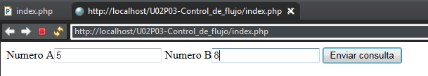

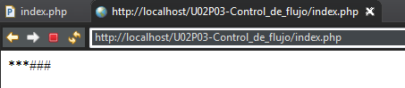

##### Parte 2: “ecf-suma.php”

Pedir un número X y calcular la suma de los X primeros números naturales (1 + 2 + 3 + …).

````php+HTML
<body>
<?php 
if (!isset($_POST["enviar"])){
?>
<form action="<?php echo htmlspecialchars($_SERVER["PHP_SELF"],ENT_QUOTES,"UTF-8")?>" method="post">
Numero<input type="text" name="num">
<input type="submit" name="enviar">
</form>
<?php 
}else{
   $a=$_POST["num"];
   $suma=0;
   for($x=0;$x<=$a;$x++){
       $suma+=$x;
   }
   echo "<p>La suma es $suma</p>";
}
?>
<br>
<a href="index.php">Volver</a>
</body>
````

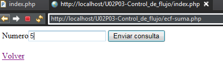

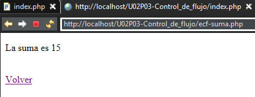

##### Parte 3: “ecf-potencia.php”

Pedir dos números A y B y calcular la potencia A elevado a B utilizando iteraciones (no una función matemática predefinida).

````php+HTML
<body>
<?php
if (!isset($_POST["enviar"])){
    ?>
<form action="<?php echo htmlspecialchars($_SERVER["PHP_SELF"],ENT_QUOTES,"UTF-8")?>" method="post">
Numero A<input type="text" name="numa">
Numero b<input type="text" name="numb">
<input type="submit" name="enviar">
</form>
<?php 
}else{
   $a=$_POST["numa"];
   $b=$_POST["numb"];
   $potencia=1;
   for($x=1;$x<=$b;$x++){
       $potencia*=$a;
   }
   echo "<p>La potencia de $a elevado a $b es $potencia</p>";
}
?>
<br>
<a href="index.php">Volver</a>
</body>
````

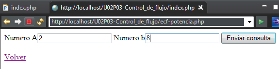

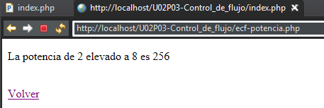

##### Parte 4: “ecf-factorial.php”

Pedir un número X y calcular su factorial utilizando iteraciones.

````php+HTML
<body>
<?php
if (!isset($_POST["enviar"])){
    ?>
<form action="<?php echo htmlspecialchars($_SERVER["PHP_SELF"],ENT_QUOTES,"UTF-8")?>" method="post">
Numero A<input type="text" name="numa">
<input type="submit" name="enviar">
</form>
<?php 
}else{
   $a=$_POST["numa"];
   $factorial=1;
   for($x=1;$x<=$a;$x++){
       $factorial*=$x;
   }
   echo "<p>El factorial de $a es  $factorial</p>";
}
?>
<br>
<a href="index.php">Volver</a>
</body>
````

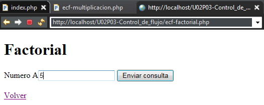

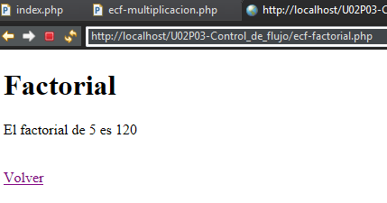

##### Parte 5: “ecf-multiplicacion.php”

Pedir un número X y mostrar su tabla de multiplicar.

````php+HTML
<body>
<h1>Multiplicación</h1>
<?php
if (!isset($_POST["enviar"])){
    ?>
<form action="<?php echo htmlspecialchars($_SERVER["PHP_SELF"],ENT_QUOTES,"UTF-8")?>" method="post">
Numero A<input type="text" name="numa">
<input type="submit" name="enviar">
</form>
<?php 
}else{
   $a=$_POST["numa"];
   for($x=1;$x<=10;$x++){
       echo "<p>$a x $x = ".($a*$x)."</p>";
   }
}
?>
<br>
<a href="index.php">Volver</a>
</body>
````

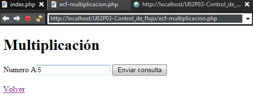

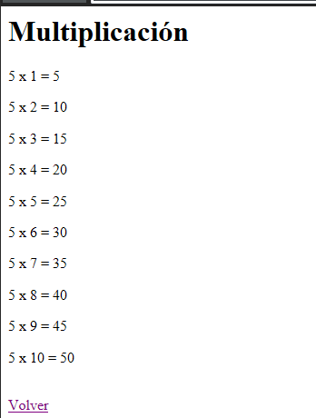

##### Parte 6: “ecf-recorte.php”

Pedir una cadena de texto y mostrarla varias veces: en cada línea se mostrará un carácter menos que en la anterior. Sólo se puede usar una función de strings: “strlen()”

```
Mi casa
Mi cas
Mi ca
Mi c
Mi 
Mi
M 
```

````php+HTML
<body>
<h1>Recorte</h1>
<?php
if (!isset($_POST["enviar"])){
    ?>
<form action="<?php echo htmlspecialchars($_SERVER["PHP_SELF"],ENT_QUOTES,"UTF-8")?>" method="post">
Cadena<input type="text" name="cadena">
<input type="submit" name="enviar">
</form>
<?php 
}else{
   $a=$_POST["cadena"];
   $s=$a;
   for($x=strlen($a);$x>0;$x--){
       for ($i=0;$i<$x;$i++){
           echo $s[$i];
       }
       echo "<br>";
   }
}
?>
<br>
<a href="index.php">Volver</a>
</body>
````

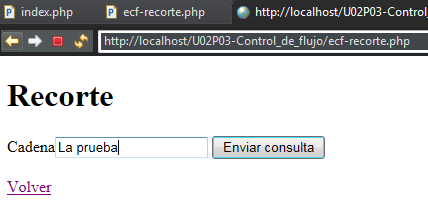

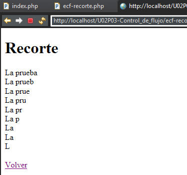

##### Parte 7: “ecf-meses”

En un formulario se recogerá un valor en un cuadro de texto y un radio group para indicar si el año actual es bisiesto o no. Habrá que comprobar si el valor leído corresponde al número de un mes (de 1 a 12) o a su nombre (“enero”, “febrero”). Si es así se mostrará el número de días que tiene ese mes, y si no es así se mostrará un error. Nota:para comparar String, busca referencia de las funciones *strcmp* y *strcasecmp*. 

````php+HTML
<body>
<h1>Recorte</h1>
<?php
if (!isset($_POST["enviar"])){
    ?>
<form action="<?php echo htmlspecialchars($_SERVER["PHP_SELF"],ENT_QUOTES,"UTF-8")?>" method="post">
Cadena<input type="text" name="cadena">
Bisiesto :
Si <input type="radio" name="bisiesto" value="si">
No <input type="radio" name="bisiesto" value="no" checked>
<input type="submit" name="enviar">
</form>
<?php 
}else{
   $a=$_POST["cadena"];
   $b=$_POST["bisiesto"];
   if ($a<=12 && $a>=1){
       switch ($a) {
           case 1:case 3: case 5:case 7:case 8:case 10:case 12:
              echo "<p>El mes $a tiene 31 dias</p>"; 
               break;
           case 4:case 6:case 9:case 11:
               echo "<p>El mes $a tiene 30 dias</p>";
               break;
           case 2:
               if ($b=="si"){
                   echo "<p>El mes $a tiene 29 dias</p>";
               }elseif ($b=="no")
                 echo "<p>El mes $a tiene 28 dias</p>";
               break;
       }
   }else if (strcasecmp($a, "febrero")==0){
       if($b=="si")
        echo "<p>$a tiene 29 dias</p>";
        elseif ($b=="no")
        echo "<p>$a tiene 28 dias</p>";
   }else if(strcasecmp($a, "enero")==0 || strcasecmp($a, "marzo")==0 || strcasecmp($a, "mayo")==0 || strcasecmp($a, "julio")==0
       || strcasecmp($a, "agosto")==0 || strcasecmp($a, "octubre")==0 || strcasecmp($a, "diciembre")==0)
       echo "<p>$a tiene 31 dias</p>"; 
   else if(strcasecmp($a, "abril")==0 || strcasecmp($a, "junio")==0 || strcasecmp($a, "septiembre")==0 || strcasecmp($a, "noviembre")==0)
       echo "<p>$a tiene 30 dias</p>"; 
}
?>
<br>
<a href="index.php">Volver</a>
</body>
````

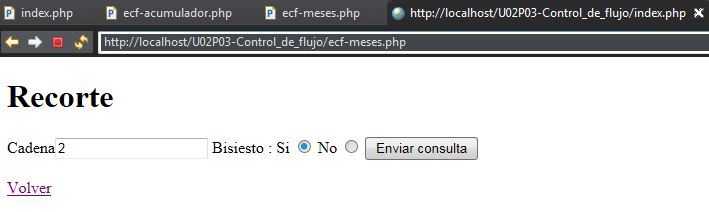


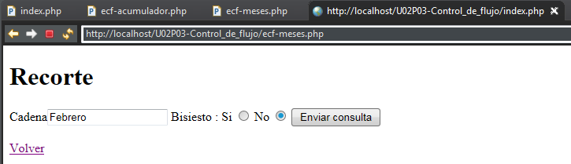

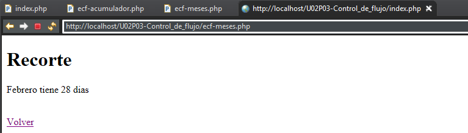

##### Parte 8: “ecf-acumulador”

Ir pidiendo por formulario una serie de números enteros (de uno en uno) e irlos sumando. Se deja de pedir números al usuario cuando la cantidad supera el valor 50. Escribir entonces la suma de todos los números introducidos. Pista: para poder mantener el valor acumulado (antes de estudiar técnicas más avanzadas) utilizar un campo de formulario de tipo oculto (“hidden”).

````php+HTML
<body>
<h1>Acumulador</h1>
<?php
$acu=0;
if(!isset($_POST["enviar"])){
      
        ?>
    <form action="<?php echo htmlspecialchars($_SERVER["PHP_SELF"],ENT_QUOTES,"UTF-8")?>" method="post">
    Numero<input type="text" name="num">
    <?php $acu=0?>
    <input type="hidden" name="acum" value="<?php echo $acu?>">
    <input type="submit" name="enviar">
    </form>
    <?php 
}else if($_POST["acum"]<50){
    ?>
    <form action="<?php echo htmlspecialchars($_SERVER["PHP_SELF"],ENT_QUOTES,"UTF-8")?>" method="post">
    Numero<input type="text" name="num">
    <?php $acu=$_POST["num"]+$_POST["acum"];?>
    <input type="hidden" name="acum" value="<?php echo $acu?>">
    <input type="submit" name="enviar">
    </form>
    <?php
    if ($acu>50)
        echo "<p>Has pasado de los 50</p>";
    else
        echo "<p>La suma total es: ".$acu."</p><br>";<br>";
}else{
    echo "<p>Has pasado de los 50</p>";
}

?>
<br>
<a href="index.php">Volver</a>
</body>
````

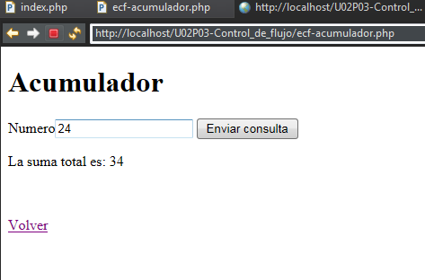

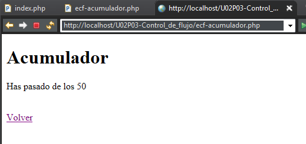


##### Parte 9: “ecf-multiplos”

Mostrar en pantalla los múltiplos de 3 y 5 entre el 1 y el 1000. A continuación mostrar en pantalla los 20 primeros múltiplos de 3 y 5.

````php+HTML
<body>
<h1>Recorte</h1>
<?php
for ($i=1;$i<=1000;$i++){
    if ($i%3==0){
        echo "<p>$i es multiplo de 3</p>";
    }
    if ($i%5==0){
        echo "<p>$i es multiplo de 5</p>";
    }
}
$i=1;$x=1;
while($x<=20){
    if($i%3==0 || $i%5==0){
        if ($i%3==0)
            echo "<p>$i es el multiplo número $x de 3</p>";
        else
            echo "<p>$i es el multiplo número $x de 5</p>";
        $x++;
    }
    $i++;
}
?>
<br>
<a href="index.php">Volver</a>
</body>
````

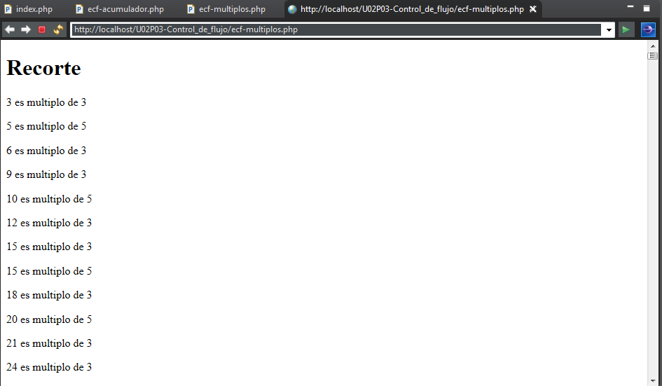

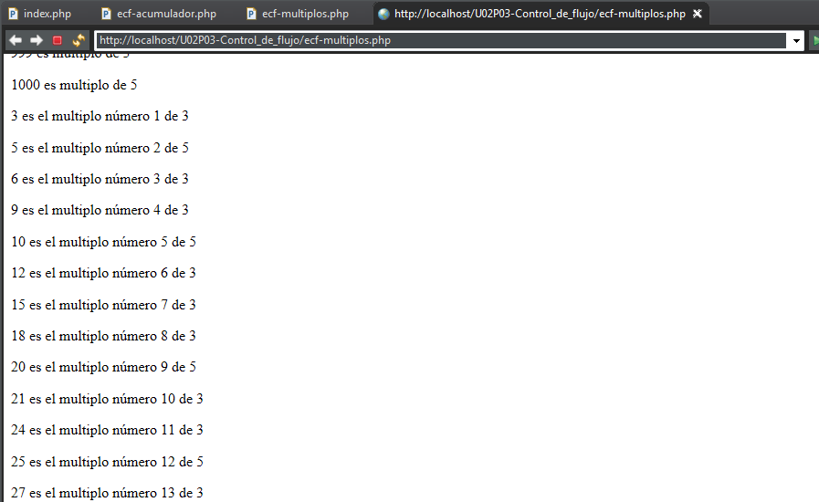

##### Parte 10: “ecf-cuadrado”

Pedir un número X y generar un cuadrado como el que se muestra en la figura (en este caso X vale 10). Una vez resuelto, mejorarlo para que las filas pares salgan en un color más claro (lightblue por ejemplo) para facilitar la lectura. En la figura se ha usado un “padding” de 3 para los elementos de celda (td).

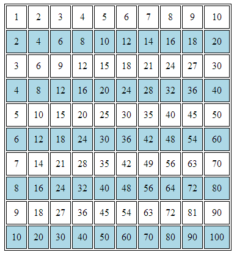

````php+HTML
<body>
<h1>Cuadrado</h1>
<?php
if (!isset($_POST["enviar"])){   
    ?>
<form action="/U02P03-Control_de_flujo/ecf-cuadrado.php" method="post">
Numero<input type="text" name="num">
<input type="submit" name="enviar">
</form>
    <?php 
    }else{
        $x=$_POST["num"];
        $num=1;
        ?>
    <table border="1">
         <?php
         for($i=1;$i<=$x;$i++){
             
          echo "<tr>";
          for($j=1;$j<=$x;$j++){
           if($i%2==0){
               echo "<td style='padding:3px;
                        background-color:lightblue;'>".$num."</td>";
            $num++;
           }else{
               echo "<td style='padding:3px;'>".$num."</td>";
            $num++;
            }
           }
           echo "</tr>";
           
          }
    }
        ?>
	</table>
<br>
<a href="index.php">Volver</a>
</body>
````

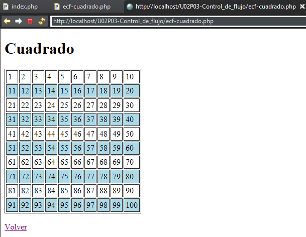