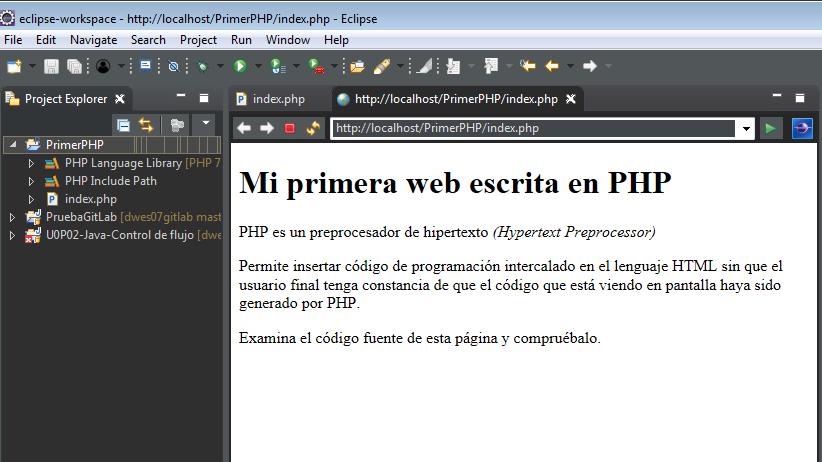

###### *Desarrollo Web en Entorno Servidor - Curso 2017/2018 - IES Leonardo Da Vinci - Alberto Ruiz*
## U2P01 - Instalación y configuración de XAMPP y Eclipse PDT
#### Entrega de: *Zhenyu Guo*
----
#### 1. Descripción:

El objetivo de la práctica es preparar el entorno de trabajo para desarrollar aplicaciones web en PHP. Para ello instalaremos los servidores necesarios con XAMPP y probaremos la extension de Eclipse para  trabajar con PHP.

#### 2. Formato de entrega:

Incluye capturas de pantalla en los pasos que consideres más relevantes. Este documento te servirá así además de tutorial si más adelante repites esta configuración.

#### 3. Trabajo a realizar:

Sigue las indicaciones de la practica e introduce las capturas de pantalla que estimes oportunas para ilustrar el proceso. De esta forma el documento generado te servirá de manual de instalación y configuracion más adelante.

##### Parte 1: Instalación de XAMPP

1. Accede a [la web de XAMPP](https://www.apachefriends.org/es/index.html) y descarga la version para tu sistema operativo
2. Instala XAMPP en la unidad raiz (C). Puedes seleccionar los componentes que desees. Los que nosotros usaremos son PHP, MySQL, el lenguaje PHP y la herramienta phpMyAdmin. El resto de opciones no son necesarias pero puedes instalarlas para explorar el conjunto completo y realizar pruebas más avanzadas.
3. Abre el panel de control de XAMPP. Configura la barra de tareas para que el icono del panel de control esté siempre visible
4. Observa que los servidores no se inician por defecto. Puedes comprobarlo accediendo a *http://localhost* desde un navegador
5. Con el botón *Config* del panel de control puedes configurar algunas cosas, como por ejemplo:
  * Hacer que el panel de control se inicie con el sistema operativo
  * Escoger Notepad++ como editor predeterminado para manipular los archivos de configuración de los diferentes servidores


##### Parte 2: Prueba de Apache y PHP

1. Inicia el servidor web Apache y accede a tu pagina web
2. Localiza la carpeta *htdocs* dentro de la carpeta de XAMPP, donde podras situar tus paginas web. Escribe una pagina *prueba.html" y comprueba el resultado de acceder a *http://localhost/prueba.html* desde el navegador
3. Escribe y prueba ahora la pagina *prueba.php* con el siguiente código:

```php
<!DOCTYPE html>
<html>
<head>
<meta charset="UTF-8"/>
<title>Primer ejemplo de PHP</title>
</head>
<body>
<?php
echo "<h1>Mi primera web escrita en PHP</h1>\n";
echo "<p>PHP es un preprocesador de hipertexto <em>(Hypertext Preprocessor)</em></p>\n";
?>
<p>Permite insertar código de programación intercalado en el lenguaje HTML sin que el usuario final tenga constancia de que el código que está viendo en pantalla haya sido generado por PHP.</p>
<?php
echo "<p>Examina el código fuente de esta página y compruébalo.</p>\n";
// el código PHP queda oculto al usuario final
echo "<!-- sólo se verá lo que nosotros queramos-->\n";
$variableSecreta = 12345;
?>
</body>
</html>
```


##### Parte 3: Trabajando con PHP en Eclipse


Trabajar con Eclipse en PHP es posible, pero requiere cierto trabajo inicial:

   * Instalar las herramientas de desarrollo PHP
   * Integrar nuestro proyecto con el servidor web
   * Integrar nuestro proyecto con Git (opcional)

Vamos a realizar estos pasos:

###### Parte 3.1: Instalación y configuración de Eclipse PDT

Vamos a instalar el complemento de Eclipse para trabajar con PHP. Después indicaremos a Eclipse que queremos usar nuestro servidor Apache incluido en XAMPP para ejecutar las aplicaciones web.

1. Dentro de Eclipse, accede a *Eclipse > Help > Install new software*

2. En el campo *Work with* escribe esta dirección y pulsa Intro: http://download.eclipse.org/tools/pdt/updates/5.0

3. Instala *PHP Development Tools*

4. Reinicia Eclipse

5. Accede al menú *Windows > Preferences > PHP > PHP Servers*. Aparecerá *Default PHP Web Server*: pulsa en *Edit*

6. Como *Base URL* dejaremos *http://localhost*, y como *Document Root* escogeremos la carpeta *htdocs* que esta dentro de la carpeta de instalación de XAMPP.

   

7. Pulsa en *Finalizar*.
###### Parte 3.2: Creación y ejecución de un proyecto PHP

En esta parte crearemos un proyecto PHP. Ten en cuenta que para ejecutar un proyecto es necesario que su código sea accesible por el servidor Apache, es decir, debe estar dentro de la carpeta *htdocs* de XAMPP.

1. Crea un nuevo proyecto PHP, al que puedes llamar *PrimerPHP*

2. Gracias a la configuración de entorno de ejecución que hicimos antes, ahora Eclipse nos sugerirá crear el proyecto *on a local server* en lugar de en nuestro *workspace*. Observa cómo el campo *Directory* se actualiza indicándonos que se creará la subcarpeta *PrimerPHP* dentro de *htdocs*.

   

3. Pulsa en *Finalizar*

4. Crea un nuevo archivo PHP en el proyecto llamado *index.php* y escribe un codigo de prueba (puedes reutilizar el anterior)

5. Asegúrate de que el servidor Apache está activo mediante el panel de control de XAMPP

6. Pulsa en el desplegable del botón *Run* y escoge *Run as > PHP Web Application*

7. Se nos preguntará por la página principal del proyecto, que normalmente es *index.php*

8. Comprueba el resultado. ¿Se ven bien las tildes? Eclipse no trabaja por defecto con el juego de caracteres UTF-8. Para configurarlo de cara a futuros proyectos, accede a *Window > Preferences > General > Content Types > Text > PHP Content Type*. Seleccionar todos los tipos o al menos \*.php, y escribe *UTF-8* en el recuadro *Default encoding*. Es muy importante que pulses en *Update* antes de salir.

   

9. A pesar de haber hecho esto, al añadir archivos ya existentes a nuestros proyectos podemos tener problemas en la forma en que el workspace los interpreta. Para evitar esos problemas accede a *Window > Preferences > General > Workspace* y en *Text file encoding* escoge *Other: UTF-8*.

   

10. Elimina el archivo PHP y vuélvelo a crear con el mismo contenido. Comprueba que ahora los símbolos de tilde o *ñ* se visualizan bien. Es posible que tengas que refrescar el navegador con F5.
###### Parte 3.3: Integración de Eclipse PDT con Git

Hasta ahora hemos visto que los proyectos PHP no se almacenarán en nuestra carpeta *workspace*, sino en la raíz del servidor web. Si además queremos utilizar Git, debemos modificar el servidor Apache para indicar que la raíz del servidor ya no sera *htdocs* sino nuestra carpeta de repositorio de Git.  

1. Edita el archivo de configuración `httpd.conf` de Apache situado en la carpeta de instalación de XAMPP. Observa que puedes acceder directamente desde el panel de control de XAMPP con el botón *Config* de Apache.

2. Modifica los valores *DocumentRoot* y *\<Directory>*  para que apunten a nuestra carpeta de repositorio *dwesXX*
    * Para obtener la ruta: accede a la carpeta con el explorador de archivos de Windows, pulsa en la barra superior, y obtendrás la ruta

    * Si tienes problemas con la ruta, sustituye las barras `\` por `/`

      

3. Reinicia el servicio Apache HTTPD mediante el panel de control de XAMPP

4. Actualiza la nueva carpeta tambien en la sección *DocumentRoot* de la configuracion del servidor PHP en Eclipse: *Windows > Preferences > PHP > PHP Servers > Edit*

    

5. Elimina en Eclipse el proyecto PruebaPHP (incluyendo el borrado de archivos) y crea de nuevo uno nuevo con el nombre *U2P01-PHPGit*. Observa que se crea ya en la nueva ubicación

    

    

6. Crea un nuevo archivo *index.php* con el código de ejemplo que venimos utilizando.

7. Pulsa en el desplegable del botón *Run* y escoge *Run as > PHP Web Application*

8. Se nos preguntará por la página principal del proyecto, que normalmente es *index.php*

9. Realiza *Commit* y *Push* del proyecto a tu repositorio y comprueba en la web del mismo que se ha subido correctamente.

    

Comentarios a esta solución:

* Cambiar la ubicacion de *htdocs* no afecta a las herramientas como *phpmyadmin*, que seguirán siendo accesibles con la URL `http://localhost/phpmyadmin`. Esto es debido al archivo de configuración `httpd-xampp`, accesible también desde el panel de control de XAMPP, que establece *alias* para ciertas rutas.
* Una alternativa para no cambiar la ubicacion de *htdocs* sería trabajar de la forma habitual y utilizar un script Ant para copiar los archivos fuente de nuestra carpeta de trabajo local a la carpeta *htdocs*


###### Parte 3.4 (opcional): Configuracion de tu entorno de desarrollo en máquina real

Se sugiere realizar los siguientes pasos para configurar el espacio de trabajo en la máquina real (no recomendado por su mayor complejidad):

* Instalacion de JDK en la maquina real (no requiere permisos si se descarga dentro de la carpeta de usuario)
* Instalación de Eclipse en la máquina real
* Configuracion del repositorio Git deseado en Eclipse (utilizar la partición de Datos)
* Utilización de una máquina virtual Windows o Linux para la instalacion del servidor WAMPP/LAMPP/XAMPP
* Configuracion de una carpeta compartida en la máquina virtual que enlace a la carpeta del repositorio en la máquina real
    * Tras reiniciar sesión, se asignará una letra de unidad a la carpeta compartida (por ejemplo F:), dato necesario para poder especificar la ruta en el paso siguiente
* Configuración de la carpeta raíz de Apache en la máquina virtual para que apunte a la carpeta compartida
* Modo de trabajo con esta solución: usar la máquina real para desarrollar y la máquina virtual para realizar las pruebas
* Una mejora muy importante: puedes configurar reenvío de puertos para poder acceder desde tu maquina real al servidor web de la máquina virtual. De esta forma podrás tener la máquina virtual minimizada. Para hacerlo:
    * Accede a la configuración de Red de la máquina en VirtualBox
    * Asegúrate de que está en modo NAT y de que tu sistema operativo está configurado para obtener la IP de forma automática
    * En *Avanzado* pulsa en *Reenvío de puertos*
    * Añade una regla para el protocolo TCP que asocie el puerto 8000 de la máquina real (sistema anfitrión) al puerto 80 de la máquina virtual (sistema invitado). No es necesario introducir direcciones IP
    * Reinicia el servidor Apache (en principio no es necesario reiniciar la máquina virtual)
    * Comprueba que puedes acceder desde la máquina real mediante *localhost:8000*
    * Modifica la configuración del servidor PHP por defecto en Eclipse, para que en lugar de *localhost* utilice *localhost:8000*. Es posible que con proyectos ya existentes no se actualice bien el funcionamiento.
* Sugerencia de ampliación: ¿qué es Vagrant? ¿qué es Docker?
