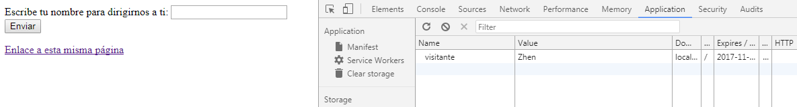
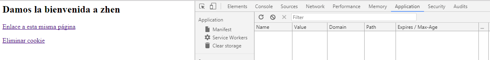

###### *Desarrollo Web en Entorno Servidor - Curso 2017/2018 - IES Leonardo Da Vinci - Alberto Ruiz*
## U2P06 - Cookies en PHP
#### Entrega de: *Zhenyu Guo*
----
#### 1. Descripción:

Vamos a probar el funcionamiento de las cookies en PHP.

#### 2. Formato de entrega:

Incluye capturas relevantes, y fragmentos de código con las modificaciones que se van pidiendo.

#### 3. Trabajo a realizar:

##### Parte 1: Análisis de cookies

* Averigua cómo mostrar en Firefox y Chrome las cookies que tienen almacenadas ambos navegadores. Incluye una captura del listado de cookies en ambos.

Chrome:


Firefox:


* Ahora accede a alguna web que sepas que utilice cookies (son casi todas). Incluye una captura de las cookies accesibles para este sitio web en concreto:
  * Chrome: *Más herramientas > Herramientas para desarrolladores > Application > Cookies*

    

  * Firefox: *Desarrollador > Inspector > Almacenamiento > Cookies*. Inicialmente está deshabilitada la sección de Almacenamiento. Para habilitarla, haz clic en los ajustes del inspector (icono de rueda dentada) y marca la casilla de Almacenamiento.

    

* Observa que puedes **acceder rápidamente a estas herramientas** haciendo clic en la página con el botón secundario y escogiendo *Inspeccionar*.

* Entra en la web de conversión de divisas [www.xe.com](www.xe.com). Averigua a través del formulario cuántos euros son 2000 coronas islandesas (ISK). Puedes elegir otras divisas para la prueba.

  

* Cierra el navegador y comprueba que al volver a abrirlo y regresar a la web, el formulario "recuerda" las divisas sobre las que querías hacer la conversión.

  

* Utilizando el inspector, incluye una captura en la que se vean las cookies. ¿Puedes identificar la cookie o cookies responsables de recordar las divisas?

  

* Elimina la cookie o cookies que crees responsables, y actualiza el navegador para comprobar el resultado.

  

##### Parte 2: Cookies en PHP

* Crea un nuevo proyecto PHP llamado *U2P06-PHP-Cookies*
* Crea una carpeta `cookies` en la estructura del proyecto
* Codifica el archivo `cookies.php` dentro de esa carpeta con el siguiente código:

```php
<html>
<head>
<title>Cookies</title>
<meta charset="UTF-8"/>
</head>
<body>
<?php
if(isset($_POST["enviar"])) {
	setcookie("visitante", $_POST["nombre"], time() + (86400 * 15), "/"); // 86400 = segundos en 1 día
}
if(isset($_COOKIE["visitante"])) {
	echo "<h2>Damos la bienvenida a $_COOKIE[visitante]</h2>";
}
else
{ // solicitar nombre al usuario
?>
<form action="<?php echo $_SERVER['PHP_SELF']?>" method="post">
    <label>Escribe tu nombre para dirigirnos a ti:</label>
    <input type="text" name="nombre"><br/>
    <input type="submit" value="Enviar" name="enviar">
</form>
<?php
}
?>
<p><a href="<?php echo $_SERVER['PHP_SELF']?>">Enlace a esta misma página</a></p>
</body></html>
```

* El objetivo de esta página es el siguiente:
  * Si existe cookie en el equipo indicando el nombre de usuario, se mostrará un mensaje de bienvenida
  * Si no existe la cookie, se mostrará un formulario para introducir el nombre
  * Si se ha pulsado el botón *Enviar* del formulario, se creará la cookie

  Al final de la página incluímos un enlace a ella misma: el objetivo será comprobar los cambios respecto a las cookies sin tener que recargar la página utilizando los botontes del navegador.

##### 2.1 Funcionamiento básico de las cookies

* Ejecuta la aplicación en uno de los navegadores que estudiaste en la Parte 1 de esta práctica. Antes de realizar ninguna prueba, activa las herramientas de desarrollador para comprobar que no hay cookies para este sitio.

  

* Rellena el formulario con tu nombre y haz clic en *Enviar*. Comprueba con las herramientas del navegador que se ha creado correctamente la cookie: sin embargo, se ha mostrado el formulario otra vez. El motivo es que la cookie sólo será leída al cargar la página. Para comprobarlo, haz clic en el enlace y comprueba que ahora sí aparece el nombre

  

##### 2.2 Modificación de cookies

La modificación de una cookie (o de uno de sus parámetros) se hace sobreescribiendo su valor llamando de nuevo a `setCookie`. Debido a la anomalía de funcionamiento descrita en el apartado anterior, puedes probar la modificación sin modificar el código, siguiendo estos pasos:
  1. Abre la página `cookies.php` en un navegador y muestra las herramientas de desarrollador para poder examinar las cookies en tiempo real.

  2. Introduce tu nombre en el formulario: comprueba que la cookie se actualiza con ese valor

     

  3. Debido a que las cookies sólo se leen al cargar la página, se nos muestra de nuevo el formulario: ahora introduce el nombre de tu compañero y hac clic en *Enviar*

  4. Observa que la cookie tiene ya almacenada el nombre de tu compañero (se ha modificado), pero ves tu nombre debido al mismo efecto de desfase.

     

  5. Haz clic en el enlace para volver a cargar la página, y comprueba que ahora sí que aparece el nombre de tu compañero.

     

  6. Corrige el desfase sufrido en estas últimas pruebas. Para ello utiliza la función 'header' (ver apuntes) para forzar la recarga de la página en el momento en que se modifica el valor de la cookie.

     

##### 2.3 Caducidad de las cookies

* Examina la fecha de caducidad de la cookie en las herramientas del navegador

* Modifica el código de tu programa para que la cookie caduque a los 15 segundos

* Comprueba que pasado ese tiempo desde que introduces tu nombre, si haces clic en el enlace para volver a cargar la página desaparece la cookie y vuelve a mostrarse el formulario

  

##### 2.4 Eliminación de cookies

* La eliminación de una cookie se realiza fijando una fecha de caducidad anterior a la actual. Para probarlo:
  * Introduce en tu código un enlace *Eliminar cookie* que redirija a esta misma página, pero incluyendo un parámetro *eliminarCookie* con el valor que desees, por ejemplo *true* o el nombre de la cookie.

  * Modifica tu código para que, en caso de recibir el parámetro *eliminarCookie*, se elimine la cookie.

    ````php+HTML
    <html>
    <head>
    <title>Cookies</title>
    <meta charset="UTF-8"/>
    </head>
    <body>
    <?php
    if(isset($_POST["enviar"])) {
    	setcookie("visitante", $_POST["nombre"], time() + 15, "/"); // 86400 = segundos en 1 día
    	header("Location: ".$_SERVER['PHP_SELF']);
    	$eliminarCookie=false;
    }

    if (isset($_REQUEST["eliminarCookie"])){
        setcookie("visitante", null , time() - 1, "/");
    }
    if(isset($_COOKIE["visitante"])) {
    	   echo "<h2>Damos la bienvenida a $_COOKIE[visitante]</h2>";
        
    }
    else
    { // solicitar nombre al usuario
    ?>
    <form action="<?php echo $_SERVER['PHP_SELF']?>" method="post">
        <label>Escribe tu nombre para dirigirnos a ti:</label>
        <input type="text" name="nombre"><br/>
        <input type="submit" value="Enviar" name="enviar">
    </form>
    <?php
    }

    ?>
    <p><a href="<?php echo $_SERVER['PHP_SELF']?>">Enlace a esta misma página</a></p>
    <p><a href="<?php echo $_SERVER['PHP_SELF']?>?eliminarCookie=true">Eliminar cookie</a></p>
    </body></html>
    ````

  * Observa que se mantiene el efecto de desfase y es necesario volver a cargar la página para apreciar el efecto de la eliminación

  

  

  

##### 2.5 Ámbito de validez de las cookies

* Ejecuta tu aplicación para dar valor a la cookie. Ahora carga cualquier página PHP de otro proyecto de tu servidor (de una práctica anterior). Utiliza las herramientas de desarrollador para comprobar que la cookie está presente también en esta página. Si no la ves, ten en cuenta que quizá ha caducado (puedes ampliar el tiempo de caducidad para darte más tiempo para realizar pruebas)

  

* Dentro de la función *setCookie*, modifica la carpeta de ámbito de validez de la cookie: cambia "/" por "/U2P06-PHP-Cookies/" (puede que tengas que ajustar la ruta si has usado una configuración personalizada del servidor). Comprueba que no hay cambios en el funcionamiento para la página *cookies.php*, pero comprueba también que la cookie ya no está disponible en otros proyectos

  

  

* Crea en tu proyecto una página `cookies2.php`, en esta ocasión **fuera** de la carpeta `cookies`. El código será:

```php
<html>
<head>
<title>Cookies y sesiones</title>
<meta charset="UTF-8"/>
</head>
<body>
<?php
if(isset($_COOKIE["visitante"])) {
	echo "<h2>Damos la bienvenida a $_COOKIE[visitante]</h2>";
}
else {
	echo "<h2>No se encuentra el nombre del visitante</h2>";
}
?>
<a href="<?php echo $_SERVER['PHP_SELF']?>">Enlace a esta misma página</a>
</body></html>
```

* Mantén en dos pestañas del navegador ambas páginas (`cookies.php`y `cookies2.php`). Comprueba que cuando das valor a la cookie en la primera, la segunda muestra dicho valor.

  

* Ahora modifica de nuevo el ámbito para que sea "/U2P06-PHP-Cookies/cookies". Comprueba que ahora la página `cookies2.php` ya no puede leer la cookie.

  

##### 2.6 Detección de cookies deshabilitadas

Es raro que un navegador tenga las cookies deshabilitadas, pero puede ocurrir.

* Modifica tu código para mostrar un mensaje en caso de no poder escribir cookies:

```php
<?php
setcookie("test", "test", time() + 3600, '/');
if(count($_COOKIE) ==0) echo "<h3>Advertencia: tu navegador tiene las cookies deshabilitadas. Esta aplicación no funcionará</h3>";
?>
```
* Averigua cómo se deshabilitan las cookies en Firefox y Chrome, y hazlo en ambos navegadores

  Chrome:

  

  Firefox:

  

* Prueba tu aplicación en los dos navegadores y comprueba que obtienes el mensaje de error (incluye capturas)

  Chrome:

  

  Firefox:

  

* Vuelve a configurar los navegadores para que admitan cookies
