###### *Desarrollo Web en Entorno Servidor - Curso 2017/2018 - IES Leonardo Da Vinci - Alberto Ruiz*
## U2P07 - Sesiones en PHP
----
#### 1. Descripción:

Vamos a probar el funcionamiento de las sesiones en PHP. Primero utilizaremos las herramientas de desarrollador de nuestros navegadores para analizar el comportamiento de las sesiones. Después codificaremos un ejemplo guiado que aportará un contador a nuestra página. Por último tendrás que utilizar las sesiones para resolver un problema propuesto.

#### 2. Formato de entrega:

Incluye capturas y bloques de código en los momentos relevantes

#### 3. Trabajo a realizar:

##### Parte 1: Análisis de sesiones

* Abre un navegador Chrome o Firefox y muestra las herramientas de desarrollador para poder analizar las cookies, tal como hicimos en la práctica anterior.

* Inicia sesión en el curso virtual de Moodle. Observa las diferentes cookies: ¿puedes distinguir las de sesión? Incluye captura de las cookies.

  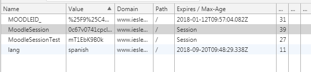

* Comprueba cómo al cerrar la sesión de Moodle, las cookies de sesión no han desaparecido, pero ya no puedo acceder: el motivo es que la sesión sólo ha sido borrada desde el lado del servidor, pero nuestra cookie permanece.

  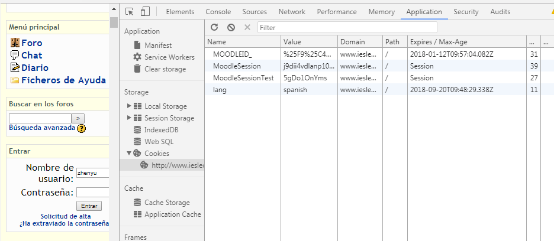

* Inicia sesión de nuevo y borra la cookie de forma manual a través de las herramientas de desarrollador del navegador. Observa el resultado.

* Inicia de nuevo sesión pero ahora, durante la misma, borra las cookies del navegador (normalmente esta acción se enmarca en el menú de *Privacidad*): comprueba cómo se pierde la sesión actual y es necesario autenticarse de nuevo. Observa, como dijimos antes, que la cookie con el identificador de sesión permanece en nuestro navegador: pero aunque no podamos verlo, el servidor ha borrado los datos asociados a nuestro identificador de sesión.

* Realiza la misma prueba con una sesión de correo electrónico, por ejemplo en Gmail. Incluye capturas de las cookies. Gmail utiliza cookies para recordar la cuenta o cuentas a las que se accede habitualmente desde el navegador. Para probarlo, inicia sesión con un mismo navegador con dos cuentas diferentes. Intenta localizar alguna cookie relativa a este contenido e incluye la captura de todas las cookies de Gmail.

  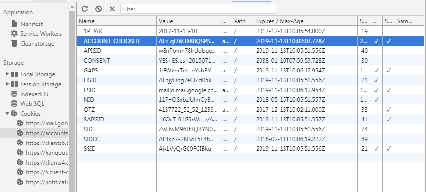

* Elimina las cookies del navegador

* Accede a [www.gmail.com](www.gmail.com), introduce tu dirección de correo y, antes de enviar la contraseña, observa que se te ofrece la opción "Recuérdame" que mencionábamos en los apuntes. Desmarca esta casilla.

* Inicia sesión y localiza la cookie SID. Haz una captura que muestre su fecha de expiración.

  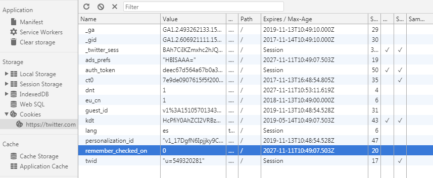

* Cierra sesión y, al iniciarla de nuevo, marca ahora la casilla de "Recuérdame". Si ya no la ves, borra las cookies del navegador y vuelve a acceder.

* Haz una captura que muestre la fecha de expiración de la cookie SID. Observa la diferencia.

  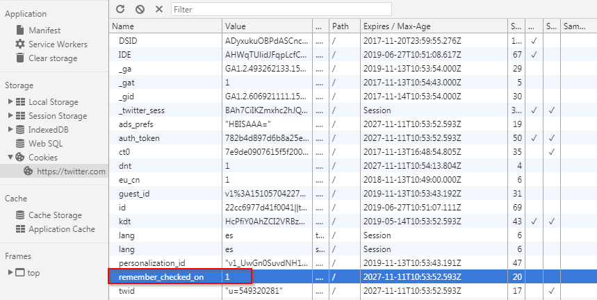

* Entra en Amazon u otra tienda digital y escoge comprar dos productos. Comprueba que se añaden a la cesta de la compra, sin que hayamos introducido usuario y contraseña

* Utilizando el inspector, incluye una captura en la que se vea la cookie que demuestra que se ha iniciado una sesión. Observa que no puedes encontrar ningún dato relativo a la cesta de la compra, puesto que esos datos los almacena internamente el servidor, asociados a tu identificador de sesión.

  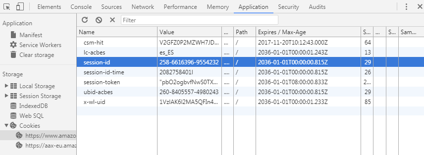

##### Parte 2: Gestión de sesiones en PHP

###### 2.1: Uso de sesión para contar los accesos

* Dentro de tu proyecto *U2P07-Sesiones*, crea una carpeta `sesiones` y dentro codifica un archivo `contador.php` con el siguiente código:

```php
<?php
if (session_status () == PHP_SESSION_NONE)
	session_start ();
if (isset ( $_SESSION ['contador'] ))
	$_SESSION ['contador'] += 1;
else
	$_SESSION ['contador'] = 1;
$mensaje = "Has visitado esta página " . $_SESSION ['contador'] . " veces en esta sesión.";
?>
<html>
<head>
<title>Sesiones</title>
<meta charset="UTF-8"/>
</head>
<body>
<h3><?php echo $mensaje;?></h3>
<p><a href="<?php echo $_SERVER['PHP_SELF']?>">Recargar la página</a></p>
</body></html>
```

Observa que el código anterior puede hacerse más breve eliminando las llaves en las cláusulas *if* o *else* que sólo contienen una sentencia, pero por claridad se han incluido todos los bloques de llaves.
* Ejecuta la aplicación en un navegador y observa las cookies. Incluye una captura en la que se vea cómo se llama la cookie que almacena la sesión existente, y cómo en lugar de indicarse fecha de caducidad se especifica que se trata de una cookie de sesión.

* 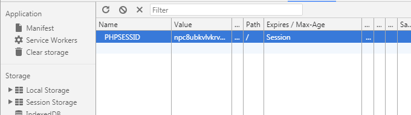

* Observa que el contador no aparece representado como una cookie: es una variable interna de la sesión, almacenada en el servidor.

* Ejecuta la aplicación varias veces y elimina la cookie de sesión de forma manual a través de las herramientas de desarrollador del navegador. Recarga la página y comprueba que se inicia una nueva sesión, con un nuevo identificador y el contador a 0. Recuerda que *session_start()* sirve tanto para recuperar una sesión existente como para crear una nueva.

  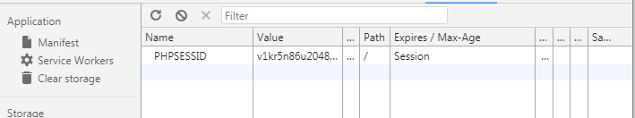

###### 2.2: Almacenamiento de la sesión en el servidor

* Ejecuta tu aplicación, accediendo dos o tres veces para incrementar el contador.

* Toma nota del valor de la cookie de sesión, o haz una captura del mismo

  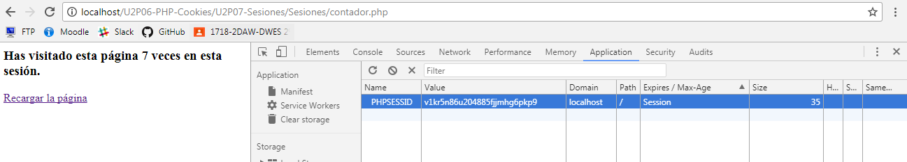

* Accede al archivo de configuración de PHP (*php.ini*) y localiza la ruta en la que se almacenan los datos de la sesión en el servidor (ver apuntes)

* Accede ahora con el explorador de archivos a esa carpeta, y localiza el archivo cuyo nombre coincida con el identificador de tu sesión

* Ábrelo con un editor de texto e incluye una captura del contenido

  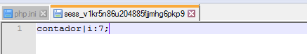

###### 2.3: Renombrado de la sesión

* Utilizando la función `session_name`, logra que la cookie de sesión se llame 'idSesion00' (siendo 00 tu número de equipo)

* Ejecuta tu aplicación e incluye captura de la cookie una vez funcione.

  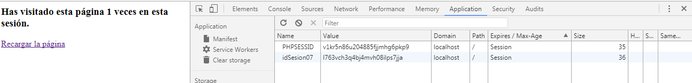

* Observa que la sesión con el nombre anterior no se elimina hasta que cierres el navegador.

* Ten en cuenta que haremos varias prácticas con sesiones, y muchas pueden convivir (si por ejemplo pruebas varias prácticas en distintas pestañas del navegador). Por eso es interesante que nombres tus sesiones de forma que se identifique fácilment a qué proyecto pertenecen.

###### 2.4: Eliminación de una variable de sesión: reinicio del contador

* Añade en el código HTML generado por tu página un enlace para reiniciar el contador:

```php
<p><a href="<?php echo $_SERVER['PHP_SELF']."?reiniciarContador=true"?>">Reiniciar contador</a></p>
```

* Ahora modifica el inicio del archivo PHP para procesar la posible petición de reinicio:

```php
if(session_status() == PHP_SESSION_NONE) {
	// código de renombrado de la sesión
	session_start();
}
if (isset($_REQUEST["reiniciarContador"])) {
	unset($_SESSION["contador"]); 
}
```

* Comprueba que el valor de la cookie de sesión permanece inalterado aunque reiniciemos el contador

  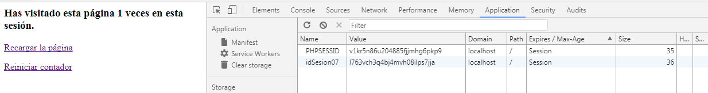

###### 2.5: Eliminación de la sesión
* Ten en cuenta que eliminar una sesión no es algo realmente necesario: basta con eliminar las variables contenidas en ella. El motivo es que la sesión terminará igualmente al cerrar el navegador, mientras que cerrarla nos obliga a añadir código. Sin embargo, vamos a hacer una prueba en esta práctica: modificaremos el código anterior para que no sólo se elimine el contador, sino que la sesión completa sea destruida. Para ello añadiremos un nuevo enlace:

```php
<p><a href="<?php echo $_SERVER['PHP_SELF']."?cerrarSesion=true"?>">Cerrar sesión</a></p>
```

Y su correspondiente bloque de código al inicio del archivo para procesarlo. El código final debería ser algo así:

```php
<?php
if(session_status() == PHP_SESSION_NONE) {
	// código de renombrado de la sesión
	session_start();
}

if (isset($_REQUEST["reiniciarContador"])) {
	unset($_SESSION["contador"]); 
}
if (isset($_REQUEST["cerrarSesion"])) {
	$_SESSION=array();
	session_unset();
	if (ini_get("session.use_cookies")) {
		$params = session_get_cookie_params();
		setcookie(session_name(), '', time() - 42000,
				$params["path"], $params["domain"],
				$params["secure"], $params["httponly"]
				);
	}
	session_destroy();
}

if(session_status() == PHP_SESSION_NONE)
	$mensaje = "No hay sesión iniciada";
else {
   if(isset( $_SESSION['contador']))
      $_SESSION['contador']+= 1;
   else
      $_SESSION['contador']=1;
	  $mensaje = "Has visitado esta página ". $_SESSION['contador']." veces en esta sesión.";
}
?>
<html>
<head>
<title>Sesiones</title>
<meta charset="UTF-8"/>
</head>
<body>
<h3><?php echo $mensaje;?></h3>
<p><a href="<?php echo $_SERVER['PHP_SELF']?>">Recargar la página</a></p>
<p><a href="<?php echo $_SERVER['PHP_SELF']."?reiniciarContador=true"?>">Reiniciar contador</a></p>
<p><a href="<?php echo $_SERVER['PHP_SELF']."?cerrarSesion=true"?>">Cerrar sesión</a></p>
</body></html>
```

* Comprueba que ahora, al pulsar en el enlace, la cookie de sesión ha desaparecido y la aplicación muestra el mensaje de que no hay sesión iniciada

  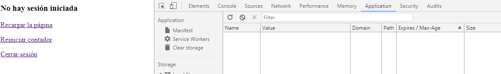

* Observa que si recargas la página, se iniciará una nueva sesión: comprueba que su identificador es nuevo, diferente al de la sesión anterior, que ya no existe.

  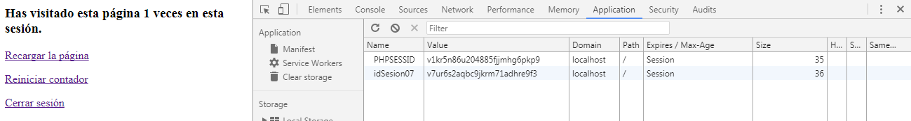

###### 2.6: Modificación de una variable de sesión

* Añade un formulario al código, de forma que el administrador pueda modificar manualmente el número de visitas. Por ejemplo, si introduce el valor *100* en el formulario, la siguiente visita que se contabilizará será la *101*.

  ````php+HTML
  <?php
  if (session_status () == PHP_SESSION_NONE){
      session_name('idSesion07');
      session_start ();
  }
  if (isset($_REQUEST["reiniciarContador"])) {
      unset($_SESSION["contador"]);
  }
  if (isset($_REQUEST["cerrarSesion"])) {
      $_SESSION=array();
      session_unset();
      if (ini_get("session.use_cookies")) {
          $params = session_get_cookie_params();
          setcookie(session_name(), '', time() - 42000,
              $params["path"], $params["domain"],
              $params["secure"], $params["httponly"]
              );
      }
      session_destroy();
  }

  if(session_status() == PHP_SESSION_NONE)
      $mensaje = "No hay sesión iniciada";
      else {
      if (isset ( $_SESSION ['contador'] ))
              $_SESSION ['contador'] += 1;
              else
                  $_SESSION ['contador'] = 1;
                  if(isset($_POST["enviar"]))
                      $_SESSION ['contador']+=$_POST["valor"];
                  $mensaje = "Has visitado esta página " . $_SESSION ['contador'] . " veces en esta sesión.";
  }
  ?>
  <html>
  <head>
  <title>Sesiones</title>
  <meta charset="UTF-8"/>
  </head>
  <body>
  <h3><?php echo $mensaje;?></h3>
  <?php 
  if (!isset($_POST["enviar"])){
  ?>
  <form action="<?php echo htmlspecialchars($_SERVER["PHP_SELF"],ENT_QUOTES,"UTF-8")?>" method="post">
  Vsitas<input type="text" name="valor">
  <input type="submit" name="enviar">
  </form>
  <?php 
  }
  ?>
  <p><a href="<?php echo $_SERVER['PHP_SELF']?>">Recargar la página</a></p>
  <p><a href="<?php echo $_SERVER['PHP_SELF']."?reiniciarContador=true"?>">Reiniciar contador</a></p>
  <p><a href="<?php echo $_SERVER['PHP_SELF']."?cerrarSesion=true"?>">Cerrar sesión</a></p>

  </body></html>
  ````

  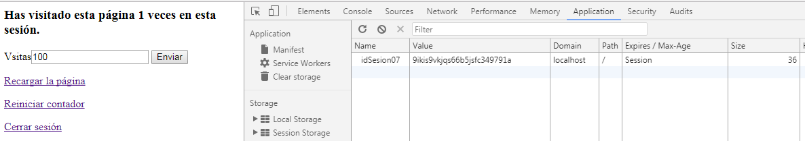

  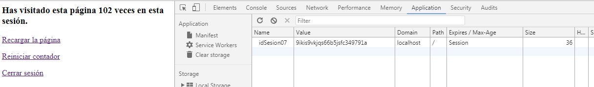

