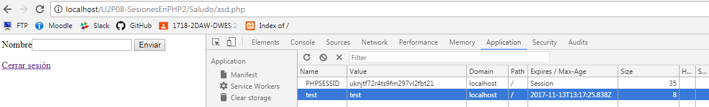
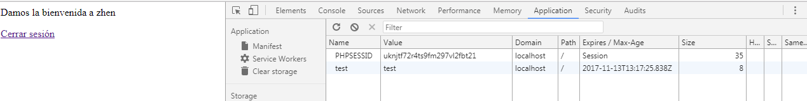
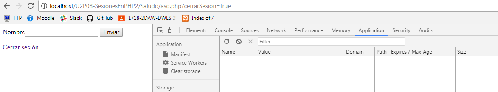
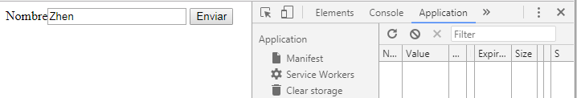
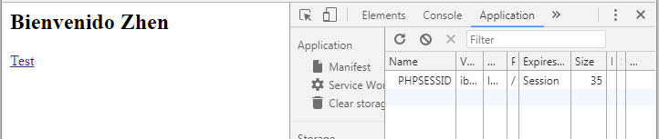
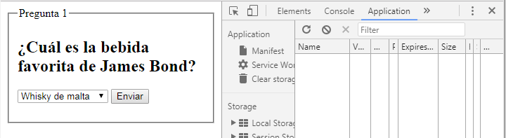
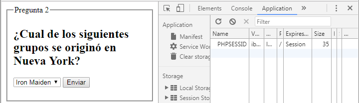
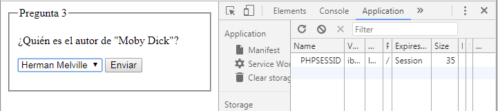
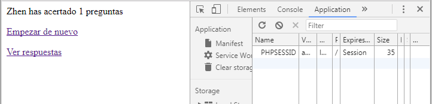
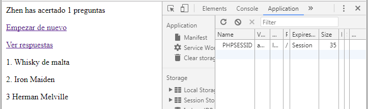

###### *Desarrollo Web en Entorno Servidor - Curso 20176/2018 - IES Leonardo Da Vinci - Alberto Ruiz*
## U2P08 - Sesiones en PHP 2
----
#### 1. Descripción:

Vamos a aplicar nuestros conocimientos de sesiones en PHP para resolver dos problemas.

#### 2. Formato de entrega:

Incluye el código generado y capturas de la ejecución, o bien muestra tu trabajo al profesor.

#### 3. Trabajo a realizar:

Crea un proyecto PHP para esta actividad. Cada parte se resolverá en una carpeta: 'saludo' y 'test'

##### Parte 1: Saludo

1. Crea un archivo `saludo.php` y codifica un único archivo PHP con el siguiente comportamiento:
   * Si no hay sesión iniciada, se mostrará un formulario para pedir nuestro nombre. Al enviar el formulario se iniciará una sesión almacenando el nombre como variable de sesión
   * Si hay sesión iniciada, se mostrará un texto como este: *Damos la bienvenida a Alberto*

Se sugiere el siguiente esquema para el archivo. Recuerda que todo el código relativo a cookies, sesiones y redirecciones se debe incluir antes de emitir código HTML:

* Antes de escribir la cabecera HTML
    * Recuperar la sesión actual o crear una nueva
    * Inicializar vacía una variable de mensaje de error
    * Si el usuario ha enviado el formulario...
      * ¿El campo de usuario del formulario está vacío?
          * Sí: Actualizar la variable de error con un mensaje explicativo
          * No: Crear una variable de sesión con el nombre del usuario
* Después de la cabecera HTML
    * ¿Tiene valor la variable de sesión que contiene al usuario?
        * Sí: Mostrar el saludo al usuario
        * No: Mostrar un formulario para introducir tu nombre

    * Si el mensaje de error no está vacío, escribirlo

        ​

Cuando lo tengas funcionando, añade un enlace de "cerrar sesión" para "olvidar" al usuario. El enlace se construirá con un parámetro *cerrarSesion=true*. El posible procesamiento de este parámetro será ahora lo primero que hagas en tu programa.

````php+HTML
<?php
if (session_status () == PHP_SESSION_NONE){
    session_start();
    $error="";
}
if (isset($_REQUEST["cerrarSesion"])) {
    $_SESSION=array();
    session_unset();
    
    $params = session_get_cookie_params();
    setcookie(session_name(), '', time() - 42000,
        $params["path"], $params["domain"],
        $params["secure"], $params["httponly"]
        );
    
    session_destroy();
}
if (isset($_POST['enviar'])){
    if (empty($_POST['valor'])){
        $error="El campo está vacío";
    }else{
        $_SESSION['nombre']=$_POST['valor'];
    }
}
?>
<html>
<head>
<title>U2P08</title>
</head>
<body>
<?php 
if (!empty($_SESSION['nombre'])){
    echo "Damos la bienvenida a ".$_SESSION['nombre'];
}else{
    ?>
<form action="<?php echo htmlspecialchars($_SERVER["PHP_SELF"],ENT_QUOTES,"UTF-8")?>" method="post">
Nombre<input type="text" name="valor">
<input type="submit" name="enviar">
</form>
    
<?php 
}
?>
<p><a href="<?php echo $_SERVER['PHP_SELF']."?cerrarSesion=true"?>">Cerrar sesión</a></p>
<?php 
if(!empty($error))
    echo $error;
?>
</body>
</html>
````








##### Parte 2: Test

En este caso vamos a trabajar con varias páginas. El objetivo es presentar al usuario un test con tres preguntas: una de cine o televisión, otra de música y otra de literatura. Tú escoges las preguntas: cada una ofrecerá tres posibilidades de respuesta. Te puede ayudar poner un fondo de colores diferentes para cada pregunta.

En esta práctica se incluye un plan, pero menos detallado. Se trata de una práctica importante porque vemos una aplicación compleja, compuesta por más de una página, en la que intervienen varios formularios. 

Pista: para saber en qué fase del juego está el usuario, tienes dos alternativas que puedes combinar:

* Llevar una variable de sesión que indique en qué fase del juego estás
* Tener una variable para almacenar la respuesta de cada fase: consultando si tienen valor sabrás en qué fase estamos

Debes crear los siguientes archivos:

* `index.php`: Si no hay sesión redirigimos a `registro.php`. Si la hay, obtenemos su nombre de la sesión, le damos la bienvenida con su nombre, y aportamos un enlace para comenzar el test. Este enlace accede a `test1.php`.

  ````php+HTML
  <?php
  session_start();
  if (!isset($_SESSION["x"])){
      header("location: registro.php");
  }else{
      $nombre=$_SESSION["x"];
      $saludo = "<h2>Bienvenido $nombre</h2>";
      ?>
  <html>
  <head></head>
  <body>
  <?php echo $saludo ?>
  <a href="<?php echo 'test1.php'?>">Test</a>
  </body>
  </html>
      <?php 
  }
  ?>
  ````

* `registro.php`: Si ya hay sesión iniciada se redirige directamente a `index.php`. En caso contrario se muestra un formulario pidiendo nuestro nombre. El formulario es procesado por este mismo archivo: su misión será iniciar la sesión y crear una variable para almacenar el nombre del usuario.

  ````php+HTML
  <?php
  if (session_status () != PHP_SESSION_NONE){
      header("location: index.php");  
  }else{

  if(isset($_POST['enviar'])){
     session_start();
     $_SESSION["prueba"]="Contenido";
     $_SESSION["x"]=$_POST['nombre'];
     header("location: index.php");
  }else{
      ?>
  <html>
  <head></head>
  <body>
  <form action="<?php echo htmlspecialchars($_SERVER["PHP_SELF"],ENT_QUOTES,"UTF-8")?>" method="post">
  Nombre<input type="text" name="nombre">
  <input type="submit" name="enviar">
  </form>
  </body>
  </html>
      <?php
  }
  }
  ?>
  ````

* `test1.php`: si no hay sesión iniciada se redirige a `registro.php`. Si la hay, se muestra la pregunta. El formulario será procesado por esta misma página: se almacenará el acierto o fallo de esta pregunta en sesión (sin decirle aún nada al usuario) y se redirigirá a la siguiente página de test.

  ````php+HTML
  <?php
  session_start();
  if (!isset($_SESSION["x"])){
      header("Location: registro.php");  
  }else{
      ?>
      <html>
      <head></head>
      <body>
      <?php 
      if (!isset($_POST["enviar"])){
      ?>
      <fieldset>
      <legend>Pregunta 1</legend>
      <form action="<?php echo htmlspecialchars($_SERVER["PHP_SELF"],ENT_QUOTES,"UTF-8")?>" method="post">
      <h2>¿Cuál es la bebida favorita de James Bond?</h2>
      <select name="p1">
      	<option>Whisky de malta</option>
      	<option>Martini con vodka</option>
      	<option>Bloody mary</option>
      </select>
      <input type="submit" name="enviar">
      </form>
      </fieldset>
      <?php 
      }else{
          $_SESSION["respuesta1"]=$_POST["p1"];
          header("Location: test2.php");
      }
      ?>
      </body>
      </html>
      <?php 
  }
  ?>
  ````

* `test2.php`: Igual que la anterior, pero se debe comprobar no sólo que estemos registrados sino que hayamos respondido ya la primera pregunta, en otro caso seremos redireccionados a la página adecuada.

  `````php+HTML
  <?php
  session_start();
  if (!isset($_SESSION["x"])){
      header("Location: registro.php");
  }else if (!isset($_SESSION["respuesta1"])){
      header("Location: test1.php");
  }else{
      ?>
      <html>
      <head></head>
      <body>
      <?php 
      if (!isset($_POST["enviar"])){
      ?>
      <fieldset>
      <legend>Pregunta 2</legend>
      <form action="<?php echo htmlspecialchars($_SERVER["PHP_SELF"],ENT_QUOTES,"UTF-8")?>" method="post">
      <h2>¿Cual de los siguientes grupos se originó en Nueva York?</h2>
      <select name="p2">
      	<option>Iron Maiden</option>
      	<option>Anthrax</option>
      	<option>Megadeth</option>
      </select>
      <input type="submit" name="enviar">
      </form>
      </fieldset>
      <?php 
      }else{
          $_SESSION["respuesta2"]=$_POST["p2"];
          header("Location: test3.php");
      }
      ?>
      </body>
      </html>
      <?php 
  }
  ?>
  `````

* `test3.php`: Igual que la anterior (podrías añadir más páginas de preguntas si lo deseas). En este caso al procesar la respuesta se redirigirá a `resultados.php`

  ````php+HTML

  ````

* `resultados.php`: Como siempre, si no hay sesión o nos faltan preguntas por responder, seremos redireccionados. En otro caso mostraremos el número de respuestas acertadas al usuario. Incluiremos un enlace para comenzar de nuevo (en este caso borraremos la sesión y redireccionaremos a `registro.php`)

  ````php+HTML
  <?php
  session_start();
  if (!isset($_SESSION["x"])){
      header("Location: registro.php");
  }else if (!isset($_SESSION["respuesta1"])){
      header("Location: test1.php");
  }else if (!isset($_SESSION["respuesta2"])){
      header("Location: test2.php");
  }else if (!isset($_SESSION["respuesta3"])){
      header("Location: test3.php");
  }else{
      ?>
      <html>
      <head></head>
      <body>
     	<?php 
     	$cont=0;
     	?>
     	<?php 
     	if ($_SESSION["respuesta1"] == "Martini con vodka")
     	    $cont++;
     	if($_SESSION["respuesta2"] == "Anthrax")
     	    $cont++;
     	if($_SESSION["respuesta3"] == "Herman Melville")
     	    $cont++;
     	
     	 echo $_SESSION["x"]." has acertado ".$cont." preguntas";
     	
      ?>
      <p><a href="<?php echo $_SERVER['PHP_SELF']."?denuevo=true"?>">Empezar de nuevo</a></p>
      <p><a href="<?php echo $_SERVER['PHP_SELF']."?respuesta=true"?>">Ver respuestas</a></p>
      <?php 
      if (isset($_REQUEST["respuesta"])){
          echo "<p>1. ".$_SESSION["respuesta1"]."</p><p> 2. ".$_SESSION["respuesta2"]."</p><p> 3 ".$_SESSION["respuesta3"]."</p>";
      }
      if (isset($_REQUEST["denuevo"])){
          $_SESSION=array();
          session_unset();
          
          $params = session_get_cookie_params();
          setcookie(session_name(), '', time() - 42000,
              $params["path"], $params["domain"],
              $params["secure"], $params["httponly"]
              );
          
          session_destroy();
          header("location: registro.php");
      }
      ?>
      
      </body>
      </html>
      <?php 
  }
  ?>
  ````

  

  

  

  

  

  

  


