###### *Desarrollo Web en Entorno Servidor - Curso 2017/2018 - IES Leonardo Da Vinci - Alberto Ruiz*
## U3P02 - Acceso a bases de datos en PHP
#### Entrega de: *Zhenyu Guo*
----
#### 1. Descripción:

Vamos a estudiar cómo nuestras aplicaciones web pueden leer y escribir en bases de datos relacionales. Utilizaremos para ello la extensión *mysqli*, aunque finalmente propondremos la investigación de la interfaz PDO.

#### 2. Formato de entrega:

Incluye las capturas de pruebas que consideres adecuadas. Enseña al profesor las diferentes páginas PHP que generes.

#### 3. Trabajo a realizar:

##### Parte 1: Acceso a bases de datos con la extensión *mysqli*

* Crea un proyecto PHP llamado U3P02-PHP-BBDD
* Crea un nuevo archivo PHP y escribe en él la estructura básica de una página web, definiendo además las variables necesarias para la conexión a la base de datos, por ejemplo:

```php
<html>
<head>
	<title>Conexión a BBDD con PHP</title>
	<meta charset="UTF-8"/>
</head>
<body>
<h2>Pruebas con la base de datos de animales</h2>
<?php
$servidor = "localhost";
$usuario = "alumno";
$clave = "alumno";
?>
<p> Vamos a utilizar las siguientes variables:</p>
<ul>
<?php
echo "<li>Nombre del servidor al que nos vamos a conectar a MySQL: $servidor</li>";
echo "<li>Nombre de usuario con el que nos vamos a conectar a MySQL: $usuario</li>";
echo "<li>Contraseña del usuario en MySQL: $clave</li>";
?>
</ul>
</body>
</html>
```
* Visualiza la página web en un navegador. Después examina su código fuente. ¿Pueden verse las variables? Analiza el proceso de petición y respuesta: ¿Es posible que alguien intercepte nuestra contraseña?  Volveremos más adelante sobre este tema.

  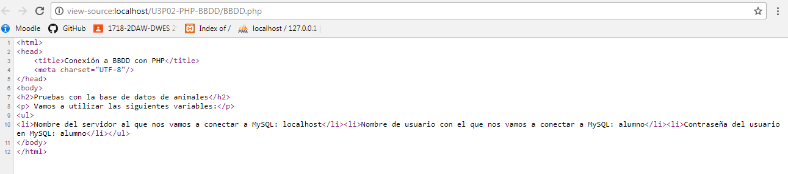

* Añade este código para probar la conexión al motor de bases de datos:

```php
<?php
echo "<h3>Estableciendo conexión...</h3>";
$conexion = new mysqli($servidor,$usuario,$clave);
if ($conexion->connect_errno) {
	echo "<p>Error al establecer la conexión (" . $conexion->connect_errno . ") " . $conexion->connect_error . "</p>";
}
else {
	echo "<p>Información de servidor: $conexion->host_info</p>";
	echo "<h3>Desconectando...</h3>";
	mysqli_close($conexion);
}
?>
```
* Ejecútalo. Observa que estamos manejando un objeto que representa la conexión (creado con el constructor a partir del operador *new*) y accediendo después a atributos de dicho objeto (mediante el operador *->*).

  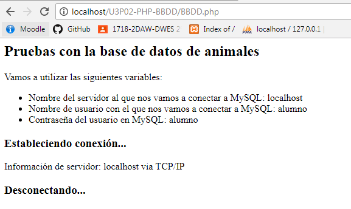

* Prueba a cerrar el servidor de bases de datos desde el panel de control de XAMPP y ejecutar de nuevo.

  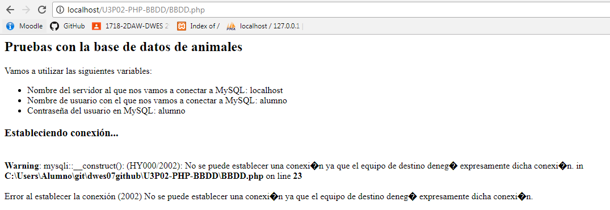

* Ahora nos conectaremos a una base de datos y haremos una consulta sencilla, mostrando los resultados en el navegador. Crea un archivo PHP diferente, por ejemplo `conexion2.php`, con una estructura básica HTML similar pero añadiendo este código:

```php
<?php
$conexion = new mysqli($servidor,$usuario,$clave,"animales");
//si quisiéramos hacerlo en dos pasos:
// $conexion = new mysqli($servidor,$usuario,$clave);
// $conexion->select_db("animales");

if ($conexion->connect_errno) {
	echo "<p>Error al establecer la conexión (" . $conexion->connect_errno . ") " . $conexion->connect_error . "</p>";
}
echo "<p>A continuación mostramos algunos registros:</p>";
$resultado = $conexion -> query("SELECT * FROM animal ORDER BY nombre");
if($resultado->num_rows === 0) echo "<p>No hay animales en la base de datos</p>";
$fila=$resultado->fetch_assoc();
while($fila!=null) {
	echo "<hr>";
	echo "Nombre:" . $fila['nombre'];
	echo "<br>Especie: $fila[especie]"; // observa la diferencia en el uso de comillas
	$fila=$resultado->fetch_assoc();
}
echo "<h3>Desconectando...</h3>";
mysqli_close($conexion);
?>
```
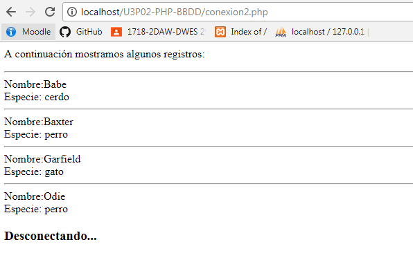

* Observa cómo se comprueba que no hay resultados, consultando el número de filas devueltas

* Comprueba si la consultas SQL son sensibles a las mayúsculas

* En la misma página, añade el código necesario para mostrar los nombres de los cuidadores, de la misma forma en la que hemos mostrado los animales. Ten en cuenta que el campo *nombre* difiere en una mayúscula en las tablas de animal y cuidador. ¿Son los nombres de campos sensibles a las mayúsculas?

* En este caso vamos a hacer dos consultas en una misma página. Se recomienda liberar la memoria consumida por una consulta antes de realizar otra. Para ello incluye esta línea justo antes de realizar la consulta que averigua los nombres de los cuidadores:
  `mysqli_free_result($resultado);`

* ¿Se muestran bien los caracteres acentuados en los cuidadores? Si no es así, añade esta consulta justo después de crear el objeto $conexion:
  `$conexion->query("SET NAMES 'UTF8'");`

* Esto debería hacer que todo se muestre bien. Observa que ni la consulta ni el juego de caracteres son sensibles a las mayúsculas.

  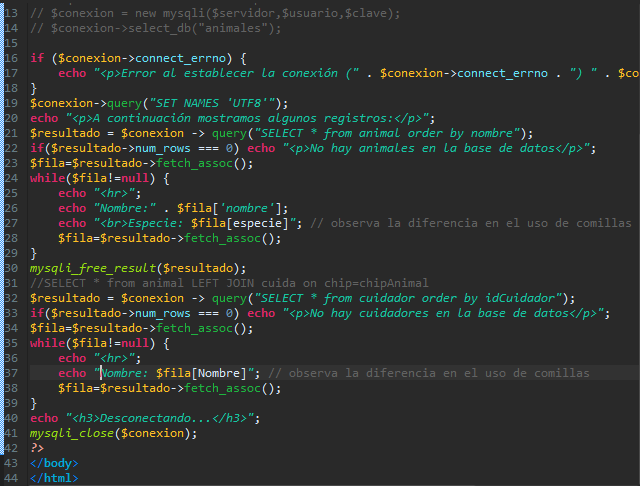

  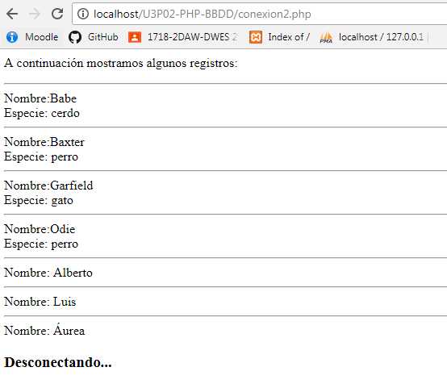

* Si sigues viendo mal los caracteres españoles, comprueba:
  * Que tu archivo PHP está codificado en UTF-8
  * Que indicas en el código HTML que se generará código codificado en UTF-8 (mediante `<meta>`)
  * Que la comunicación con el servidor de BBDD utiiza cotejamiento UTF8 internacional (*utf8mb4_unicode_ci*) o español (*utf8mb4_spanish_ci*). Esto se puede cambiar en la página principal de phpMyAdmin, *Configuraciones generales*.
  * Que tu base de datos y tus tablas utilizan esa misma codificación: esto se cambia en la sección *Operaciones* de la base de datos, y en *Estructura de tabla* en las tablas.

* Ahora mejoraremos el formato. Crea un nuevo archivo `conexion3.php`. Manteniendo la estructura y código para la conexión y desconexión, añade:

```php
<table style='border:0'>
<tr style='background-color:lightblue'>
	<th>Chip</th>
	<th>Nombre</th>
	<th>Especie</th>
	<th>Imagen</th>
</tr>
<?php
$resultado = $conexion -> query("SELECT * FROM animal ORDER BY nombre");
if($resultado->num_rows === 0) echo "<p>No hay animales en la base de datos</p>";
$fila=$resultado->fetch_assoc();
while($fila!=null) {
	echo "<tr style='background-color:lightgreen'>";
	echo "<td>$fila[chip]</td>";
	echo "<td>$fila[nombre]</td>";
	echo "<td>$fila[especie]</td>\n";
	echo "<td>$fila[imagen]</td>\n";
	echo "</tr>";
	$fila=$resultado->fetch_assoc();
}
?>
</table>
```
* Observa que la estructura del *while* es similar a la de `conexion2.php`:
  * Obtenemos una fila del resultado de la consulta
  * Mientras la fila no sea nula:
    * Procesamos la fila
    * Leemos una nueva fila
      Este código es totalmente correcto, pero puede resumirse de la siguiente forma:
  ```php
  <?php
  $resultado = $conexion -> query("SELECT * FROM animal ORDER BY nombre");
  if($resultado->num_rows === 0) echo "<p>No hay animales en la base de datos</p>";
  while($fila=$resultado->fetch_assoc()) {
  	echo "<tr style='background-color:lightgreen'>";
  	echo "<td>$fila[chip]</td>";
  	echo "<td>$fila[nombre]</td>";
  	echo "<td>$fila[especie]</td>\n";
  	echo "<td>$fila[imagen]</td>\n";
  	echo "</tr>";
  }
  ?>
  ```

* Prueba esta nueva forma y comprueba que funciona igual

* Ahora debes conseguir que se muestren realmente las imágenes en lugar de su nombre. Los pasos para conseguirlo son:

 * Crear una carpeta `img` en la estructura de tu proyecto

 * Incuir en ella las imágenes

 * Asegurarte de que los nombres de imagen coinciden con los almacenados en la base de datos

 * Definir una variable con la ruta a todas las imágenes

 * En el momento de mostrar cada imagen, construir un elemento ``. La ruta `src` se obtendrá concatenando la ruta a la carpeta con el nombre de imagen almacenado en la base de datos.

   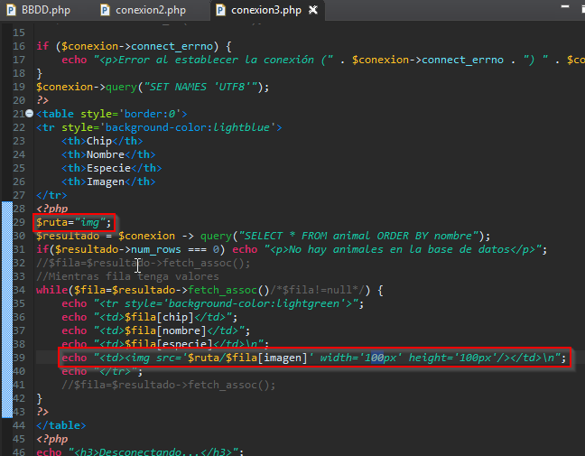

   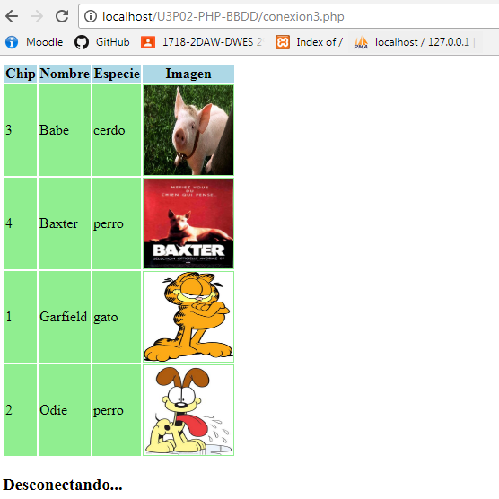

* Crea el archivo `conexion4.php`. En este caso vamos a intentar modificar una tabla con este código:

```php
<?php
$conexion ->query("UPDATE animal SET especie='jabali' WHERE nombre='Babe'");
echo "<h3 style='color:red'>". $conexion->error ."</h3>";
?>
```
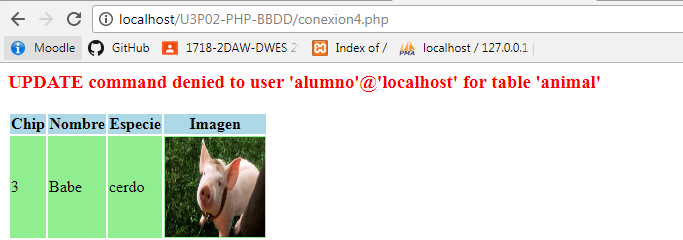

* Una vez lo hayas probado, modifica el archivo para utilizar en este caso las credenciales de tu usuario **alumno_rw**. Comprueba que ahora sí puedes realizar la operación.

  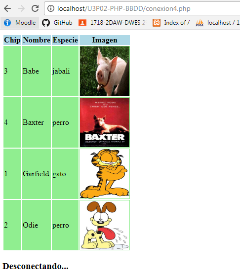

* Añade una consulta que no pueda realizarse, en este caso por no encontrarse la tabla vacía:

```php
<?php
$conexion ->query ("DROP TABLE animal");
echo "<h3 style='color:red'>". $conexion->error ."</h3>";
?>
```
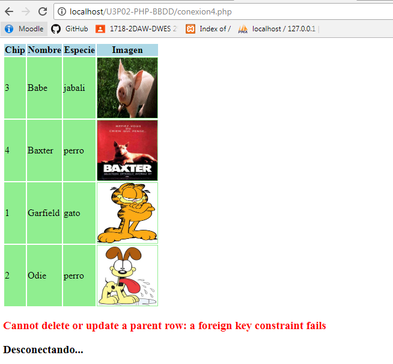

* Codifica ahora la plantilla `cuidador.php`, que muestra los datos de un cuidador que recibe como parámetro. Esto incluye los animales a los que cuida, lo que nos dará la oportunidad de probar una consulta más compleja. Para ello añade este código a tu estructura básica:

```php
<?php
// Recoger el cuidador de request
if (!isset($_REQUEST["idCuidador"])) die ("<h3>ERROR en la petición. Falta identificador de cuidador</h3>");
$id = $_REQUEST["idCuidador"];


$resultado = $conexion -> query("SELECT * FROM cuidador WHERE idCuidador = ".$id);

// Obtener los datos del cuidador
$resultado = $conexion -> query("SELECT * FROM cuidador WHERE idCuidador = ".$id);
if($resultado->num_rows === 0) die ("<h3>ERROR en la petición. Identificador de cuidador no válido</h3>");
$fila=$resultado->fetch_assoc();
echo "<h3>Animales cuidados por ".$fila['Nombre'].":</h3>";

// liberamos la memoria del resultado, que reutilizaremos después
mysqli_free_result($resultado);

// obtener los animales que cuida el cuidador
$resultado = $conexion -> query("SELECT animal.* FROM animal, cuida WHERE (animal.chip = cuida.chipAnimal) AND (cuida.idCuidador = '$id');");
if($resultado->num_rows === 0) echo "<p>Este cuidador no cuida a ningún animal</p>";
else {
	echo "<ul>";
	while($fila=$resultado->fetch_assoc()) {
		echo "<li>".$fila['nombre'].", de la especie ".$fila['especie']."</li>";
	}
	echo "</ul>";
}
?>
```
* Observa que en la primera consulta sólo queremos un resultado, por tanto no utilizamos *while*

* Prueba las siguientes consultas en el navegador:
  * `http://localhost/PHP00-BBDD/cuidador.php`: no lleva el parámetro que indica el cuidador, por tanto dará error

    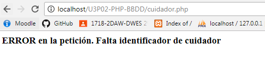

  * `http://localhost/PHP00-BBDD/cuidador.php?idCuidador=555`: el parámetro no coincide con ningún cuidador de la base de datos, por tanto también dará error

    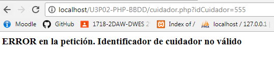

  * `http://localhost/PHP00-BBDD/cuidador.php?idCuidador=12345`: en este caso debe salir bien, mostrando los detalles del cuidador Alberto

    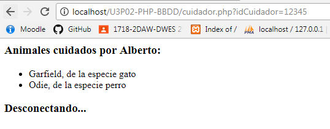

* Crea el archivo `conexion5.php`. En él mostraremos los cuidadores, como ya hicimos antes: pero en este caso se mostrarán en forma de enlaces que nos llevarán a la plantilla cuidador. El enlace llevará ya preparado el parámetro correspondiente a cada cuidador. El texto del enlace será el nombre del cuidador:

```php
<?php
echo "<h2>Listado de cuidadores</h2>";
echo "<h3>Pulsa en cada cuidador para ver los animales de los que se ocupa</h3>";

$resultado = $conexion-> query("SELECT * FROM cuidador");
if($resultado->num_rows === 0) echo "<p>No hay cuidadores en la base de datos</p>";
echo "<ul>\n";
while($fila=$resultado->fetch_assoc()) {
	echo "<li><a href='cuidador.php?idCuidador=$fila[idCuidador]'>$fila[Nombre]</a></li>\n";
  // Ejemplo: <li><a href='cuidador.php?idCuidador=12345'>Alberto</a></li>
}
echo "</ul>";
?>
```
* Prueba ahora la combinación de estas dos plantillas. Para facilitar la navegación, incluye en `cuidador.php` un enlace para volver a `conexion5.php`.

   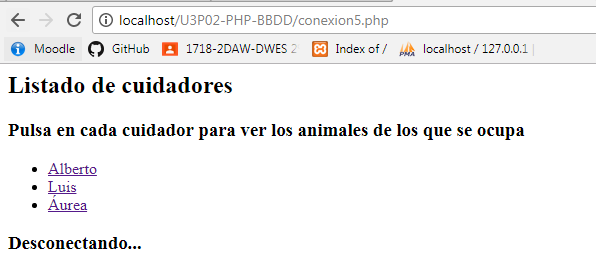

   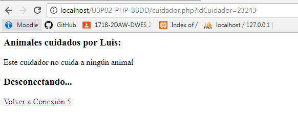

   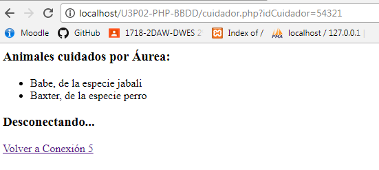

* Por último, vamos a manejar objetos. Crea `conexion6.php`, como una copia de `conexion3.php`. Ejecútala y comprueba que se muestran los datos de los animales en formato de tabla.

* Ahora crea un archivo `Animal.php` y define una clase con los cuatro atributos que tiene un animal. Notas:
   * Asegúrate de implementar la función `__toString()`, para poder escribir cómodamente los datos de los objetos.
    * No implementes constructor, puesto que entonces será más complicada la asociación directa de la base de datos a objetos.
    * Implementa métodos 'get' para las distintas propiedades

* Sustituye ahora el código que muestra la tabla de animales por este otro:
```php
<?php
$resultado = $conexion -> query("SELECT * FROM animal ORDER BY nombre");
if($resultado->num_rows === 0) echo "<p>No hay animales en la base de datos</p>";
while ($animal = $resultado->fetch_object('Animal')) {
	echo $animal."<br/>";
?>
```
* Observa que se ha asociado por orden cada elemento de la tabla con un atributo del objeto. Puedes verlo más claro con esta consulta:
  `SELECT chip, nombre, especie, imagen FROM animal ORDER BY nombre`

  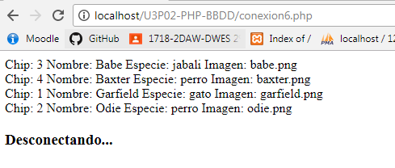

* Observa que en un primer intento hemos mostrado el animal utilizando "echo", gracias a nuestra implementación de `__toString()`. Ahora vamos a modificar el código para mostrar los datos en formato tabla:

```php
while ($animal = $resultado->fetch_object('Animal')) {
	// echo $animal."<br/>"; // primer intento más sencillo
	echo "<tr bgcolor='lightgreen'>";
	echo "<td>".$animal->getChip()."</td>\n";
	echo "<td>".$animal->getNombre()."</td>\n";
	echo "<td>".$animal->getEspecie()."</td>\n";
	echo "<td>".$animal->getImagen()."</td>\n";
	echo "</tr>";
}
```
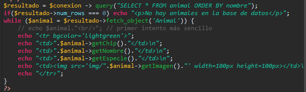

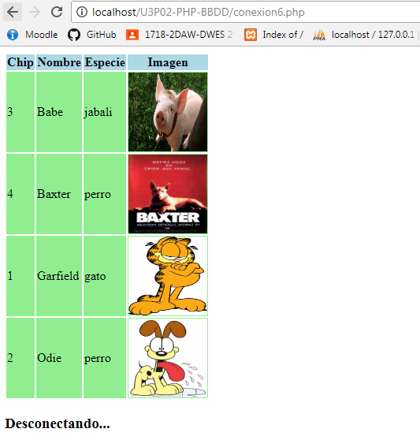

* Investiga el comportamiento de la función `fetch_object`. [Aquí](http://php.net/manual/es/mysqli-result.fetch-object.php) puedes encontrar su referencia.

* Ahora modifica tu código de la forma que consideres necesaria para probar las siguientes afirmaciones:
  * Si incluyes constructor en la clase Animal tu código falla. El motivo es que en ese caso hay que pasarle como parámetro un array con los valores que requiere el constructor. Si lo deseas puedes probarlo, pero por simplicidad es mejor que no incluyas constructor en tu clase.

    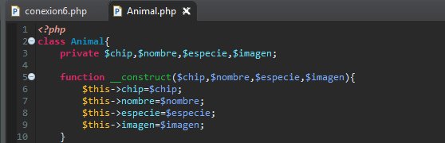

    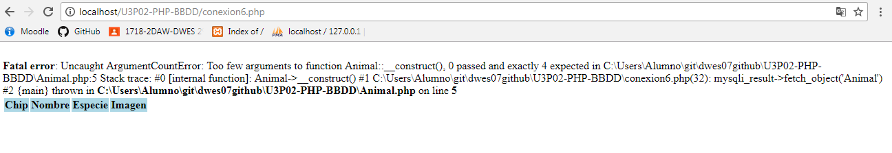

  * Las asociaciones entre campo y atributo se hacen por nombre, y no por el orden en que queden dispuestas en el SELECT

    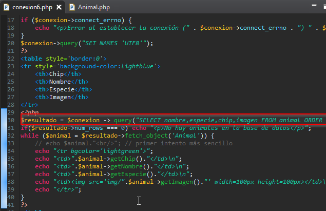

    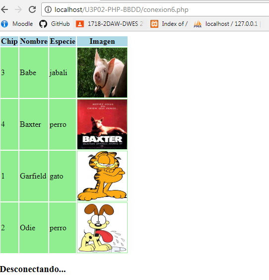

  * Da igual si nuestra clase Animal carece del campo "nombre": el objeto generado sí lo tendrá. Puedes comprobarlo usando la función `print_r` para mostrar el objeto.

    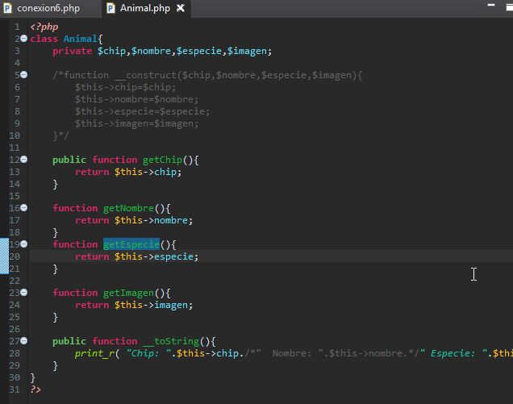

    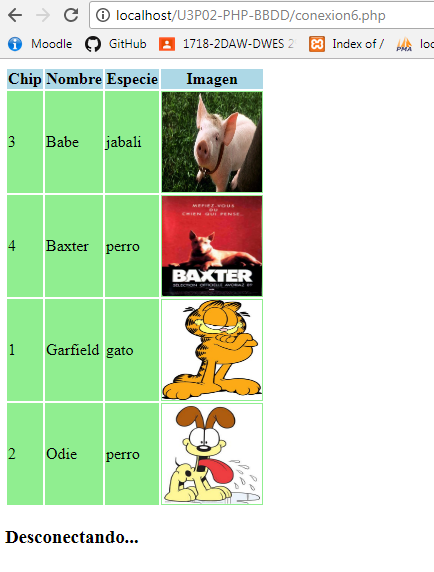

  * Si el nombre del campo y el atributo no coinciden, puedes solucionarlo con el operador AS de SQL:
    1. Cambia el nombre del atributo "especie" por "tipo" en la clase Animal

       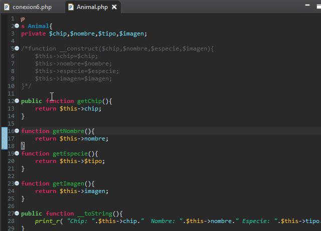

    2. Comprueba que al imprimir los datos del objeto, no aparece la especia

       

    3. Modifica ahora la consulta: `SELECT chip, nombre, especie AS tipo, imagen FROM animal ORDER BY nombre

       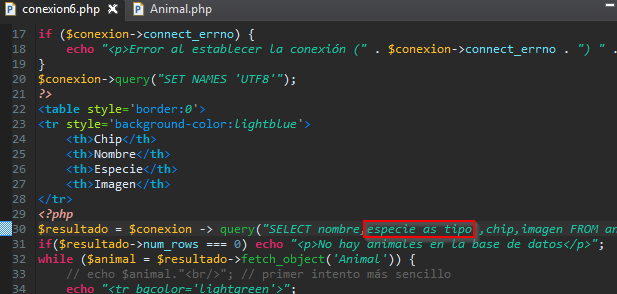

    4. Comprueba que ahora sí aparece

       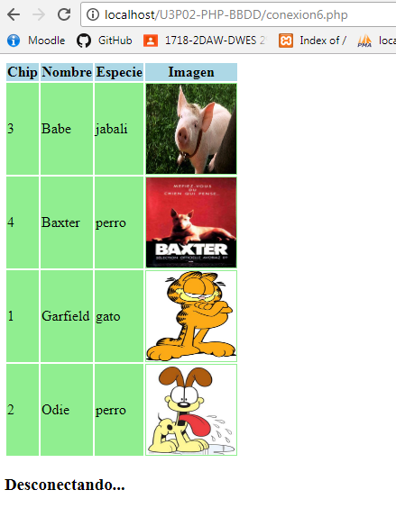

  * Si no especificamos la clase dentro de la llamada a `fetch_object`, se creará un objeto de una clase genérica `stdClass`. El ojbeto funcionará perfectamente, pero no dispondremos de ningún método (ni siquiera el `__toString`). Aún así podrás imprimirlo con `print_r`,  

    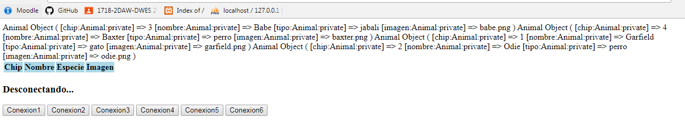

* Termina el ejercicio incluyendo enlaces entre las diferentes páginas para poder navegar entre ellas. Estas páginas te servirán más tarde de referencia para manejar bases de datos desde PHP.

* Para que puedas probar más adelante este proyecto en otros equipos (por ejemplo si utilizas Git), vamos a incluir en el proyecto el script SQL necesario para construir la base de datos:
  * Selecciona la base de datos en phpMyAdmin y genera el script en la sección *Exportar*
  * Crea una carpeta `sql` dentro de la estructura de tu proyecto
  * Copia el archivo a esa carpeta (puedes arrastrarlo al explorador de proyectos de Eclipse)

##### Parte 2 (opcional): PHP Data Objects (PDO)

La extensión Mysqli es ampliamente utilizada y totalmente válida. Sin embargo, existe una alternativa que cada vez cobra más fuerza: los PDO o PHP Data Objects. Esta interfaz permite realizar las mismas acciones, como asociar las consultas a objetos. Presenta algunas diferencias menores, pero la ventaja más importante que ofrece (aunque nosotros no la vamos a apreciar en este curso) es que es una interfaz válida para 12 motores de bases de datos, mientras Mysqli sólo sirve para MySQL / MariaDB.

En esta parte opcional puedes investigar las diferencias (busca `Mysqli vs PDO`) e intentar hacer una versión de `conexion6.php` pero utilizando PDO.

Conexion6PDO.php

````php+HTML
<html>
<head>
	<title>Conexión 2</title>
	<meta charset="UTF-8"/>
</head>
<body>
<?php
include 'Animal.php';
$servidor = "localhost";
$usuario = "alumno";
$clave = "alumno";
try{
    echo "<p>Conectando...</p>";
    $conexion = new PDO("mysql:host=$servidor;dbname=animales",$usuario,$clave);
    echo "<p>Conexión con éxito</p>";
}catch (PDOException $pdo){
    $conexion=null;
    echo "<p>Error al establecer la conexión: ".$pdo. "</p>";
    
}
$conexion->query("SET NAMES 'UTF8'");
?>
<table style='border:0'>
<tr style='background-color:lightblue'>
	<th>Chip</th>
	<th>Nombre</th>
	<th>Especie</th>
	<th>Imagen</th>
</tr>
<?php
$resultado = $conexion -> query("SELECT nombre,especie as tipo ,chip,imagen FROM animal ORDER BY nombre");

if($resultado->rowCount() === 0) echo "<p>No hay animales en la base de datos</p>";

$resultado->setFetchMode(PDO::FETCH_CLASS,'Animal');
while ($animal=$resultado->fetch()) {
    echo "<tr bgcolor='lightgreen'>";
    echo "<td>".$animal->getChip()."</td>\n";
    echo "<td>".$animal->getNombre()."</td>\n";
    echo "<td>".$animal->getEspecie()."</td>\n";
    echo "<td>getImagen()."' width=100px height=100px></td>\n";
    echo "</tr>";
}
?>
</table>
<?php 
echo "<h3>Desconectando...</h3>";
?>
<a href="BBDD.php"><button>Conexion1</button></a>
<a href="conexion2.php"><button>Conexion2</button></a>
<a href="conexion3.php"><button>Conexion3</button></a>
<a href="conexion4.php"><button>Conexion4</button></a>
<a href="conexion5.php"><button>Conexion5</button></a>
<a href="conexion6.php"><button>Conexion6</button></a>
</body>
</html>
````

